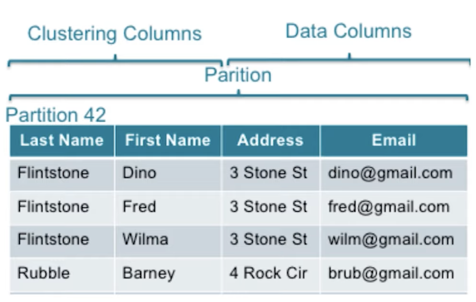
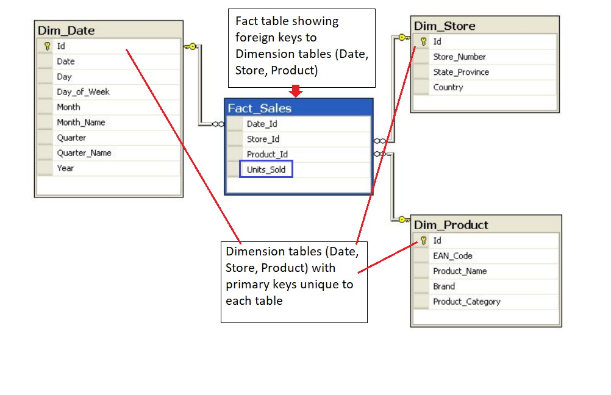
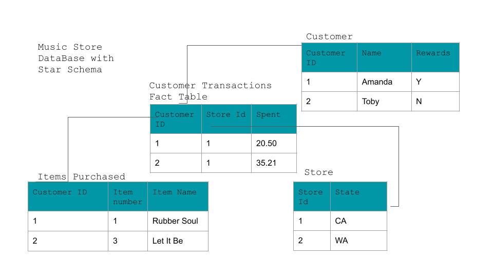

# Data Modelling

## Overview

- Introduction to data modeling
  - When to use data modeling
  - The data modeling process
- Properties of relational data models
  - ACID transactions
  - Normalization
  - Fact and Dimension table modeling
  - Star and Snowflake Schemas
  - Data definitions and constraints
- Properties of NoSQL data models
  - When to use NoSQL databases
  - Distributed database design
  - CAP Theorem
- How to create relational data models
  - Relational data modeling with Postgres
- How to create NoSQL data models
  - NoSQL data modeling with Apache Cassandra

## Introduction to Data Modelling

**Databases**: A [database](https://en.wikipedia.org/wiki/Database) is a structured repository or collection of data that is stored and retrieved electronically for use in applications. Data can be stored, updated, or deleted from a database.

**Database Management System (DBMS)**: The software used to access the database by the user and application is the database management system. Check out these few links describing a DBMS in more detail.

- [Introduction to DBMS](https://www.geeksforgeeks.org/database-management-system-introduction-set-1/)
- [DBMS as per Wikipedia](https://en.wikipedia.org/wiki/Database#Database_management_system)

### What is a Data Model**

> ...an abstraction that organizes elements of data and how they will relate to each other

So,
> Data modelling is the processing of creating data models for an information system.

The process of data modelling is to organize data into a database system to ensure that your data is persisted and easily usable by users in your organization.

It's a process to support business and user applications.

Steps:

1. Gather Requirements:
   - From application team, business users and end users to understand that what data must be retained and served as a business or the end-users.
   - First we need to map out that how our data must be stored and persisted and how that data will related to each other.
2. Conceptual Data Modelling
   - Entity mapping by hand or by using some tools.
3. Logical Data Modelling
   - Here conceptual data models are mapped to logical models using tales, schemas and columns.
4. Physical Data Modelling
   - Transform the logical data model to the DDL(Data Definition Language) to ale to create databases, tables and schemas.

Common questions:

- Why can't everything be stored in a giant excel spreadsheet:
  - Limitations to the amount of data that can be stored.
  - Read/write operations on a large scale is not possible
- Does data modeling happen before you create a database, or is it an iterative process?
  - Iterative process.
  - Have to continually reorganize, restructure and optimize data models as per the business needs.

### Why Data Model is important**

- **Data Organization**: Organized data determine later data usage.
- **Use Cases**: A well thought out data model enables straightforward and simple queries.
- **Starting early**: Begin prior to building out application, business logic and analytical models.
- **iterative process**: It's an iterative process as new requirements and new daa are introduced.

### Who does Data Modelling

Data modelling is an import skill for anyone involved in the process of using and analyzing data. including:

- Data Engineers
- Data Scientists
- Software Engineers
- Product Owners
- Business Users

### Introduction to Relational Databases

Relational and Non-relational databases do data modelling differently.

**Relational Model**
This model organized data into one or more *tables(or relations)* of *columns(attributes)* and *rows(tuples)* with a unique key identifying each row.

Generally each table represents one *entity type*.
eg: customer, product

**RDBMS(Relational Database Management System** is a software system used to maintain relational databases.

Examples of RDBMS:

- Oracle
- Teradata
- MySql
- PostgreSQL
- Sqlite
- Microsoft SQL Server

**SQL(Structured Query Language** is the language used across almost all relational database system for querying and maintaining the database.

**Database Schema**: Collection of tables
**Tables**: A group of rows sharing the same labelled elements(columns). eg: Customers

#### When to use relational databases

Advantages of Using a Relational Database

- **Flexibility for writing in SQL queries**: With SQL being the most common database query language.
- **Modeling the data not modeling queries**
- **Ability to do JOINS**
- **Ability to do aggregations and analytics**
- **Secondary Indexes available** : You have the advantage of being able to add another index to help with quick searching.
- **Smaller data volumes**: If you have a smaller data volume (and not big data) you can use a relational database for its simplicity.
**ACID Transactions**: Allows you to meet a set of properties of database transactions intended to guarantee validity even in the event of errors, power failures, and thus maintain data integrity.
**Easier to change to business requirements**

#### ACID Transactions

ACID properties are properties of database transactions intended to guarantee validity even in the event of errors or power failures.

- **Atomicity**: The whole transaction is processed or nothing is processed.
- **Consistency**: Only transactions that abide by constraints and rules are written into the database, otherwise the database keeps the previous state.
- **Isolation**: Transactions are processed independently and securely, order does not matter.
- **Durability**: Completed transactions are saved to database even in cases of system failure.

#### When not to use Relational Databases

- Have large amounts of data
- Need to be able to store different data type formats
- Need high throughput -- fast reads: While ACID transactions bring benefits, they also slow down the process of reading and writing data. If you need very fast reads and writes, using a relational database may not suit your needs.
- Need a flexible schema
- Need high availability
- Need horizontal scalability

#### PostgresSQL

PostgreSQL is an open-source object-relational database system.

- PostgreSQL uses and builds upon SQL database language by providing various features that reliably store and scale complicated data workloads.
- PostgreSQL SQL syntax is different than other relational databases SQL syntax.

All relational and non-relational databases tend to have their own SQL syntax and operations you can perform that are different between types of implementations.

**Exercise**: [Creating a Table with Postgres](exercises/L1_Exercise_1_Creating_a_Table_with_Postgres.ipynb)

### NoSQL Databases

> ..has a simpler design, simpler horizontal scaling, and finer control of availability. Data structures used are different than those in Relational Database are make some operations faster. -- Wikipedia

NoSQL databases were created do some of the issues faced with Relational Databases.

#### NoSQL Database Implementations**

- **Apache Cassandra (Partition Row store)**: The data is distributed by partitions across nodes or servers and the data is organized in the columns and rows format.
- **MongoDB (Document store)**: in addition to the key lookups performed by key-value store, the database also offers an API or query language that retrieves document based on its contents making search on documents easier.
- **DynamoDB (Key-Value store)**: the data is represented as a collection of key and value pairs.
- **Apache HBase (Wide Column Store)**: it also used tables, rows and columns. But unlike a relational database, the names and format of the columns an vary from row to row in the same table. That's it enables a flexible schema.
- **Neo4J (Graph Database)**: here relationships between entities is more the focus. The data is represented as nodes and edges.

#### Basics of Apache Cassandra

>...provides **scalability** and **high availability** without compromising performance. Linear scalability and proven **fault-tolerance** on commodity hardware or cloud infrastructure make it the perfect platform for mission-critical data. -- Apache Cassandra Documentation

<figure>
  
</figure>

- Keyspace
  - Collection of tables
- Table
  - A group of partitions
- Rows
  - A single item
- Partition
  - Fundamental unit of access
  - Collection of row(s)
  - How data is distributed
- Primary Key
  - Primary is key made up of a partition key and clustering columns.
- Columns
  - Clustering and Data
  - Labelled element
- Apache Cassandra uses its on query language called **CQL**.

**Good use cases for NoSQL (and more specifically Apache Cassandra)**:

- Transaction logging (retail, health care)
- Internet of Things (IoT)
- Time series data
- Any workload that is heavy on writes to the database (since Apache Cassandra is optimized for writes).

**Would Apache Cassandra be a hindrance for my analytics work? If yes, why?**
Yes, if you are trying to do analysis, such as using GROUP BY statements. Since Apache Cassandra requires data modeling based on the query you want, you can't do ad-hoc queries. However you can add clustering columns into your data model and create new tables.

#### When to you use a NoSQL database?

- Need to be able to store different data type formats
- Large amounts of data
- Need horizontal scalability
- Need high throughput
- Need a flexible schema
- Need high availability

#### When NOT to use a NoSQL Database?

- When you have a small dataset:
- When you need ACID Transactions: exceptions: MongoDB
- When you need the ability to do JOINS across tables
- If you want to be able to do aggregations and analytics
- If you have changing business requirements
- If your queries are not available and you need the flexibility

**Remember**:

- NoSQL databases and Relational databases do not replace each other for all tasks
- Both do different tasks extremely well, and should be utilized for the use cases they fit best.

**Exercise**: [Creating a Table with Apache Cassandra](exercises/L1_Exercise_2_Creating_a_Table_with_Apache_Cassandra.ipynb)

<hr style="border:2px solid gray">

## Relational Data Models

### Databases

**Database**: A set of related data and the way it is organized.

**Database Management System**: Computer Software that allows users to interact with the database and provides access to all of the data.

In 1969 Edgar R. Codd proposed 12 rules of what makes a database management system a true relational system.
**Rule 1**: *The information rule*:
  All information in a relational database is represented explicitly at the logical level and in exactly one way : by values in table.

### Importance of Relational Databases

- **Standardization of data model**: Once the data is transformed into the rows and columns format, the data is standardized and you can query it with SQL.
- **Flexibility in adding and altering tables**: Relational databases gives you flexibility to add tables, alter tables and to remove data.
- **Data Integrity**: Data integrity is the backbone of using a relational database.
- **Structured Query Language(SQL)**: A standard language can be used to access the data with a predefined language.
- **Simplicity**: Data is systematically stored and modelled in tabular format.
- **Intuitive Organization**: The spreadsheet format is intuitive but intuitive to data modeling in relational databases.

### OLAP vs OLTP

**Online Analytical Processing(OLAP)**:

- Databases optimized for these workloads allow complex analytical and ad hoc queries.
- These type of databases are optimized for reads.
- eg: get total stock of shoes a particular store sold(this will require aggregations)

**Online Transactional Processing(OLTP)**:

- Databases optimized for these workloads allow less complex queries in large volume.
- The type of queries for these databases are read, insert, update and delete.
- eg: get price of a show(this has very little or no aggregations).

[Stackoverflow discussions](https://stackoverflow.com/questions/21900185/what-are-oltp-and-olap-what-is-the-difference-between-them) on OLAP and OLTP.

### Structuring the Database: Normalization

**Normalization**: The process of structuring a relational database in accordance with a series of normal forms in order to reduce the data redundancy and increase data integrity.
**Denormalization**: Must be done in read heavy workloads to increase performance.

### Objectives of Normal form

- To free the database from unwanted insertions, updates and deletion dependencies.
- To reduce the need for refactoring the database as new types of data are introduced.
- To make the relational model more informative to users.
- To make the database neutral to the query statistics.

### Normal Forms

The process of normalization is a step by step process:

- First Normal Form(1NF)
- Second Normal Form(2NF)
- Third Normal Form(3NF)

#### How to Reach 1st Normal Form

- Atomic values: each cell contains unique and single values(no list of values)
- Be able to add data without altering tables
- Separate different relations into different tables
- Keep relationships between tables together with foreign keys

#### How to Reach 2nd Normal Form

- Have reached 1NF
- All columns in the table must rely on the Primary Key

#### How to reach 3rd Normal Form

- Must be in 2nd Normal Form
- No transitive dependencies(i.e; to get to C from A, avoid going through B)

**Exercise**: [Creating Normalized Tables](exercises/L2_Exercise_1_Creating_Normalized_Tables.ipynb)

### Denormalization

JOINS on the database allow for outstanding flexibility but are extremely slow. So, if we want heavy reads on the database, have to denormalize the tables.

Denormalization is the process of trying to improve the read(select) performance of a database at the expense of losing some write(insert, update, delete) performance by adding redundant copies of data.

Denormalization comes after carried out normalization.

**Normalization** is about trying to increase data integrity by reducing the number of copies of the data. Data that needs to be added or updated will be done in as few places as possible.

**Denormalization** is trying to increase performance by reducing the number of joins between tables (as joins can be slow). Data integrity will take a bit of a potential hit, as there will be more copies of the data (to reduce JOINS).

**Exercise**: [Creating Denormalized Tables](exercises/L2_Exercise_2_Creating_Denormalized_Tables.ipynb)

<hr style="border:2px solid gray">

### Fact and Dimension Tables

- Work together to create an organized data model.
- While fact and dimension are not created differently in the DDL, they are conceptual and extremely important for organization.
- **Fact table**: consists of the measurements, metrics or facts of a business process.
- **Dimension table**: dimension is a structure that categorizes facts and measures in order to enable users to answer business questions. Dimensions are people, products, place and time.
- Two of the most popular data mart schema for data warehouse are:
  - Star Schema
  - Snowflake Schema
- Unique primary key for each Dimension table is included in the Fact table.

eg:

<figure>
  
</figure>

- Dimension tables provide following info:
  - Where the product was bought? (Dim_Store table)
  - When the product was bought? (Dim_Date table)
  - What product was bought? (Dim_Product table)

- The Fact table provides the metric of the business process (here Sales).
  - How many units of products were bought? (Fact_Sales table)

### Star Schema

- Simplest style of data mart schema
- Consists of one or more fact tables referencing any number of dimension tables.
- Fact table is at its center and dimension table surrounds it.

**Benefits of Star Schema**:

- Denormalized
- Simplifies queries: Star schema allows relaxation of 3NF ruls and makes queries easier with simple JOINs.
- Fast Aggregations

**Drawbacks of Star Schema**:

- Issues that come with denormalization
- Data integrity issues
- Decrease query flexibility
- Support only one to one mapping. Many to many relationships are hard to support

<figure>
  
</figure>

### Snowflake Schemas

- Logical arrangement of tables in a multidimensional database represented by centralized fact tables which are connected to multiple dimensions.
- Can have multiple levels of relationships, child tables having multiple parents.
- While star schema does not allow for one to many relationships, snowflake schema does.
- More normalized than star schema but only in 1NF or 2NF
- [Deep Diving in the World of Data Warehousing](https://bluepi-in.medium.com/deep-diving-in-the-world-of-data-warehousing-78c0d52f49a)

**Exercise**: [Creating Fact and Dimension Tables with Star Schema](exercises/L2_Exercise_3_Dimension_Tables_with_Star_Schema.ipynb)

### Data Definition and Constraints

#### NOT NULL

This constraint indicates that column cannot contain a null value.

```sql
CREATE TABLE IF NOT EXISTS customer_transactions (
  customer_id int NOT NULL, 
  store_id int, 
  spent numeric
);
```

You can add NOT NULL constraints to more than one column. Usually this occurs when you have a COMPOSITE KEY.

```sql
CREATE TABLE IF NOT EXISTS customer_transactions (
  customer_id int NOT NULL, 
  store_id int NOT NULL, 
  spent numeric
);
```

#### UNIQUE

- Used to specify that the data across all the rows in one column are unique within the table.
- The UNIQUE constraint can also be used for multiple columns, so that the combination of the values across those columns will be unique within the table. In this latter case, the values within 1 column do not need to be unique.

```sql
CREATE TABLE IF NOT EXISTS customer_transactions (
  customer_id int NOT NULL UNIQUE, 
  store_id int NOT NULL UNIQUE, 
  spent numeric 
);
```

Another way to write a UNIQUE constraint is to add a table constraint using commas to separate the columns.

```sql
CREATE TABLE IF NOT EXISTS customer_transactions (
  customer_id int NOT NULL, 
  store_id int NOT NULL, 
  spent numeric,
  UNIQUE (customer_id, store_id, spent)
);
```

#### PRIMARY KEY

- One or more columns uniquely identify rows in the table.
- If a group of columns are defined as a primary key, they are called a **composite key**.
- By default, the PRIMARY KEY constraint has the unique and not null constraint built into it.

```sql
CREATE TABLE IF NOT EXISTS store (
  store_id int PRIMARY KEY, 
  store_location_city text,
  store_location_state text
);
```

example of composite key:

```sql
CREATE TABLE IF NOT EXISTS customer_transactions (
  customer_id int, 
  store_id int, 
  spent numeric,
  PRIMARY KEY (customer_id, store_id)
);
```

Read more on constraints [here](https://www.postgresql.org/docs/9.4/ddl-constraints.html)

### Upsert

- In RDBMS language, the term upsert refers to the idea of inserting a new row in an existing table, or updating the row if it already exists in the table.
- The action of updating or inserting has been described as "upsert".
- This is handled in PostgreSQL is by using the **INSERT** statement in combination with the **ON CONFLICT** clause.

eg:
Create table:

```sql
CREATE TABLE IF NOT EXISTS customer_address (
  customer_id int PRIMARY KEY, 
  customer_street varchar NOT NULL,
  customer_city text NOT NULL,
  customer_state text NOT NULL
);
```

**INSERT data**:

```sql
INSERT into customer_address (
VALUES
  (432, '758 Main Street', 'Chicago', 'IL'
);

```

**ON CONFLICT DO NOTHING**:

```sql
INSERT INTO customer_address (customer_id, customer_street, customer_city, customer_state)
VALUES
(
  432, '923 Knox Street', 'Albany', 'NY'
) 
ON CONFLICT (customer_id) 
DO NOTHING;

```

**ON CONFLICT DO UPDATE**

```sql
INSERT INTO customer_address (customer_id, customer_street)
VALUES
(
  432, '923 Knox Street, Suite 1' 
) 
ON CONFLICT (customer_id) 
DO UPDATE
  SET customer_street = EXCLUDED.customer_street;
```

**More on UPSERT**:

- [PostgreSQL tutorial](https://www.postgresqltutorial.com/postgresql-tutorial/postgresql-upsert/)
- [PostgreSQL documentation](https://www.postgresql.org/docs/9.5/sql-insert.html)

<hr style="border:2px solid gray">

## NoSQL Data Models

NoSQL = Not Only SQL

### When to use NoSQL

- Need high availability
- Have large amount of data
- Need Linear scalability
- Low Latency
- Need fast reads and write

### Apache Cassandra

- Open Source NoSQL DB
- Masterless Architecture
- High availability
- Linearly Scalable

### Distributed Databases

Distributed databases are databases that have scaled out horizontally.

In a distributed database, in order to have high availability you will need copies of your data.

#### Eventual Consistency

A consistency model used in distributed computing to achieve high availability that informally guarantees that, if no new updates are made to a given data item, eventually all access to that item will return the last updated value.

This means:

- Overtime if no new changes are made, each copy of the data will be the same.
- But, if there are new changes, the data may be different in different locations.
- The data may be inconsistent for only milliseconds.
- There are workarounds to prevent stale data.

*Notes*:

- Apache Cassandra is using peer to peer database architecture(every node is connected to every other nodes).
- Apache Cassandra architecture:
  - [Understanding the architecture](https://docs.datastax.com/en/archived/cassandra/3.0/cassandra/architecture/archTOC.html)
  - [Cassandra Architecture](https://www.tutorialspoint.com/cassandra/cassandra_architecture.htm)
- [How Cassandra reads and writes data](https://docs.datastax.com/en/archived/cassandra/3.0/cassandra/dml/dmlIntro.html)

### CAP Theorem

A theorem in computer science that states:
> It is impossible for a distributed data store to simultaneously provide more than two out the following three guarantees of **consistency**, **availability** and **partition tolerance**.

- **Consistence**: Every read from the database gets the latest(and correct) piece of data or an error.
- **Availability**: Every requests is received and a response is given -- without guarantee that the data is the latest update.
- **Partition Tolerance**: The system continues to work regardless of losing network connectivity between nodes.

*Notes*:

- [Discussion about ACID vs. CAP](https://www.voltactivedata.com/blog/2015/10/acid-vs-cap/)
- *The CAP theorem implies that in the presence of a network partition, one has to choose between consistency and availability.* So there is no such thing as Consistency and Availability in a distributed database since it must always tolerate network issues. You can only have Consistency and Partition Tolerance (CP) or Availability and Partition Tolerance (AP).
- Apache Cassandra it is about **Eventual Consistency** and it support Availability and Partition Tolerance in the CAP theorem.

### Denormalization in Apache Cassandra

Data Modelling in Apache Cassandra:

- Denormalization is not just okay -- it's a must
- Denormalization must be done for fast reads
- Apache Cassandra has been optimized for fast writes
- **ALWAYS** think Queries first
- One table per query is a great strategy
- Apache Cassandra **does not** allow for JOINs between tables.

*Notes*:

- When using Apache Cassandra, if your business need calls for quickly changing requirements, you need to create a new table to process the data.
- In relational databases, one query can access and join data from multiple tables. But in Apache Cassandra, one query can pull data from a single table.

### CQL

*Cassandra Query Language*

- Very similar to SQL
- Following are not supported by CQL
  - JOINS
  - GROUP BY
  - Subqueries

**Exercise**: [Exercise: Three Queries Three Tables](exercises/L3_Exercise_1_Three_Queries_Three_Tables.ipynb)

### Primary Key

- Must be unique
- The PRIMARY KEY is made up of either just the PARTITION KEY or may also include additional CLUSTERING COLUMNS .
- The PARTITION KEY will determine the distribution of data across the system
- Partition key's row value will be hashed and stored on th node in the system that holds that range of values.
- More on Primary key: [DataStax Documentation](https://docs.datastax.com/en/archived/cql/3.3/cql/cql_using/useSimplePrimaryKeyConcept.html#useSimplePrimaryKeyConcept).

**Exercise**: [Primary_Key](exercises/L3_Exercise_2_Primary_Key.ipynb)

### Clustering Columns

- The clustering column will will determine the sort order(ascending order) within a partition.
- More than one clustering column can be added or none.
- Clustering column will sort in order of how they were added to the primary key.
- Cannot use the clustering columns out of order in the SELECT statement.
- It's possible to omit a certain clustering column in the SELECT statement.

- More info:
  - [Compound Primary Key](https://docs.datastax.com/en/archived/cql/3.3/cql/cql_using/useCompoundPrimaryKeyConcept.html)
  - [Difference between partition key, composite key and clustering key in Cassandra?](https://stackoverflow.com/questions/24949676/difference-between-partition-key-composite-key-and-clustering-key-in-cassandra)
    - The **Partition Key** is responsible for data distribution across your nodes.
    - The **Clustering Key** is responsible for data sorting within the partition.
    - The **Primary Key** is equivalent to the Partition Key in a single-field-key table (i.e. Simple).
    - The **Composite/Compound** Key is just any multiple-column key
  - Examples(from aforementioned stackoverflow link):
    - PRIMARY KEY (a): The partition key is a.
    - PRIMARY KEY (a, b): The partition key is a, the clustering key is b.
    - PRIMARY KEY ((a, b)): The composite partition key is (a, b).
    - PRIMARY KEY (a, b, c): The partition key is a, the composite clustering key is (b, c).
    - PRIMARY KEY ((a, b), c): The composite partition key is (a, b), the clustering key is c.
    - PRIMARY KEY ((a, b), c, d): The composite partition key is (a, b), the composite clustering key is (c, d).

**Exercise**: [Clustering Column](exercises/L3_Exercise_3_Clustering_Column.ipynb)

### WHERE Clause

- Data Modelling in Apache Cassandra is query focused and that focus needs to on the **WHERE** clause.
- Failure to include a WHERE clause will result in an error.
- The PARTITION KEY must be included in the query and any CLUSTERING COLUMNS can be used in the order they appear in your PRIMARY KEY.
- It's recommended that one partition key be queried at a time for performance implications.
- It is possible to do a select * from table if you add a configuration ALLOW FILTERING to query. This is risky. So use only if absolutely necessary. Read more: [ALLOW FILTERING explained](https://www.datastax.com/blog/allow-filtering-explained).

**Exercise**: [Using the WHERE Clause](exercises/L3_Exercise_4_Using_the_WHERE_Clause.ipynb)

<hr style="border:2px solid gray">

## Project: Data Modelling with Apache Cassandra

### Requirement

*A startup called Sparkify wants to analyze the data they've been collecting on songs and user activity on their new music streaming app. The analysis team is particularly interested in understanding what songs users are listening to. Currently, there is no easy way to query the data to generate the results, since the data reside in a directory of CSV files on user activity on the app.*

*They'd like a data engineer to create an Apache Cassandra database which can create queries on song play data to answer the questions, and wish to bring you on the project. Your role is to create a database for this analysis. You'll be able to test your database by running queries given to you by the analytics team from Sparkify to create the results.*

### Project Overview

In this project,

- Apply concepts learned on data modeling with Apache Cassandra and complete an ETL pipeline using Python.
- Model your data by creating tables in Apache Cassandra to run queries.

**Project Code**: [Data modeling with Apache Cassandra](project/data_modelling_project.ipynb)