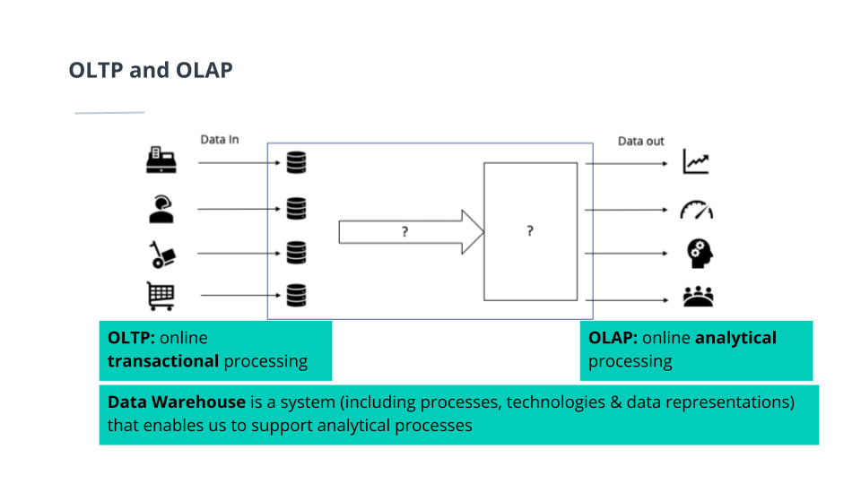
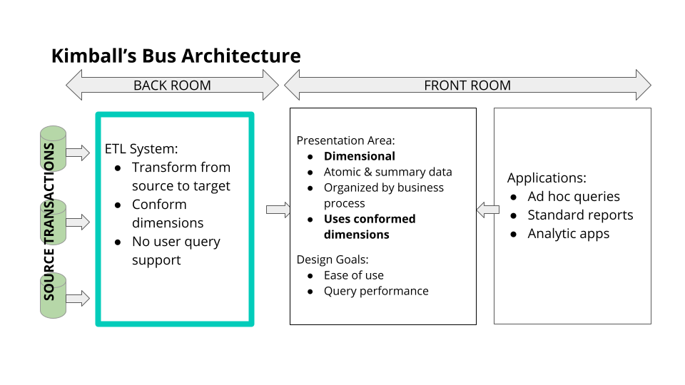

In this course, you'll develop your data engineering skills for building data warehousing solutions in the cloud. To accomplish this, you'll practice implementing data modeling techniques for analytics using SQL. You'll also extract, transform, and load data from data sources into data warehouses on the Amazon Web Services cloud.

By the end of the course, you'll gain experience in a wide range of skills, including:
- Data warehouse architecture
- Extracting, transforming, and loading data(ETL)
- Cloud data warehouses
- AWS Redshift
- Amazon S3

## Introduction To Data Warehouses

    
    <em>Data warehouse representation</em>

### Operational vs Analytical Business Processes
**Operational processes**: Make it work.
    - Find goods & make orders (for customers)
    - Stock and find goods (for inventory staff)
    - Pick up & deliver goods (for delivery staff)

**Analytical processe**s: What is going on?
    - Assess the performance of sales staff (for HR)
    - See the effect of different sales channels (for marketing)
    - Monitor sales growth (for management)

A data warehouse is designed to optimize data analysis processes and gathers data from multiple sources.

### Data Warehouse Architecture
#### Data Warehouse Design
- Copy Data(Extract): Copy data from OLTP sources into Data warehouse: optimize the data for query and analysis.
- Batch Updating(Transform): A data warehouse retrieves and consolidates data periodically.
- Dimensional Model(Load): is optimized for analytical query performance.

| *DW Design* |

#### Technical Perspective
Extract the data from the source systems used for operations, transform the data, and load it into a dimensional model.

