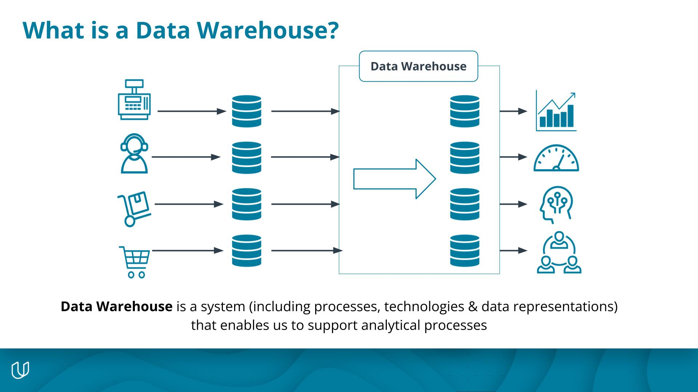

In this course, you'll develop your data engineering skills for building data warehousing solutions in the cloud. To accomplish this, you'll practice implementing data modeling techniques for analytics using SQL. You'll also extract, transform, and load data from data sources into data warehouses on the Amazon Web Services cloud.

By the end of the course, you'll gain experience in a wide range of skills, including:
- Data warehouse architecture
- Extracting, transforming, and loading data(ETL)
- Cloud data warehouses
- AWS Redshift
- Amazon S3

## Introduction To Could Data Warehouses

