# Cloud Data Warehouses

## Introduction To Data Warehouses

By the end of the lesson, you’ll be able to:

- Describe the business need for data warehouses
- Describe the architecture of data warehouses
- Run ETL processes to support dimensional modeling
- Create an OLAP cube from facts and dimensions

<figure>
  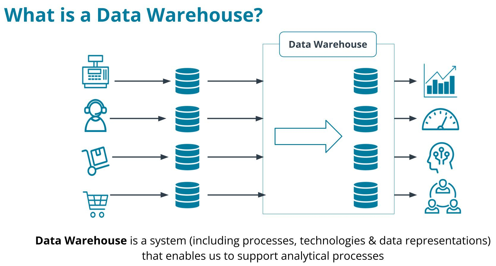
</figure>

### Data Warehouse for Business Analytics

#### Operational vs Analytical Business Processes

**Operational processes**: Make it work.
    - Find goods & make orders (for customers)
    - Stock and find goods (for inventory staff)
    - Pick up & deliver goods (for delivery staff)

**Analytical processes**s: What is going on?
    - Assess the performance of sales staff (for HR)
    - See the effect of different sales channels (for marketing)
    - Monitor sales growth (for management)

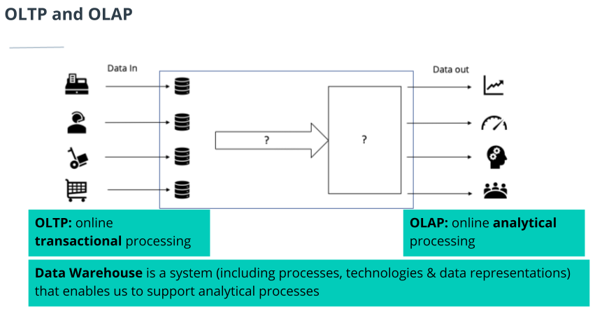

- OLTP databases have to scale and maintain a level of performance to accommodate customer transactions and will have a different level of complexity(because they integrate with multiple systems). But in case of OLAP, requirements may not be very clear and should have a flexibility.
- OLTP data need to be recent, updated and available in real-time for customers. While OLAP data needs to be historical, accurate and aggregated.
- OLTP data is often stored in normalized relational databases. While, data analysts want to work with dimensional data. 

These differences between OLTP and OLAP resulted in the invention of data warehouses.

**Data Warehouse** is a system(including processes, technologies and data representations) that enable us to support analytical processes.

Data from OLTP is moved to data warehouse to support OLAP.

<figure>
  
</figure>

A data warehouse is designed to optimize data analysis processes and gathers data from multiple sources.

### Data Warehouse Architecture

#### Data Warehouse Design(ETL)

**Extracting**:
    - Extract data from source periodically and transfer to data warehouse.

**Transforming**:
    - Integrates many sources together
    - Possibly cleansing: inconsistencies, duplication, missing values, etc..
    - Possibly producing diagnostic metadata

**Loading**:
    - Structuring and loading the data into the dimensional data model

<figure>
  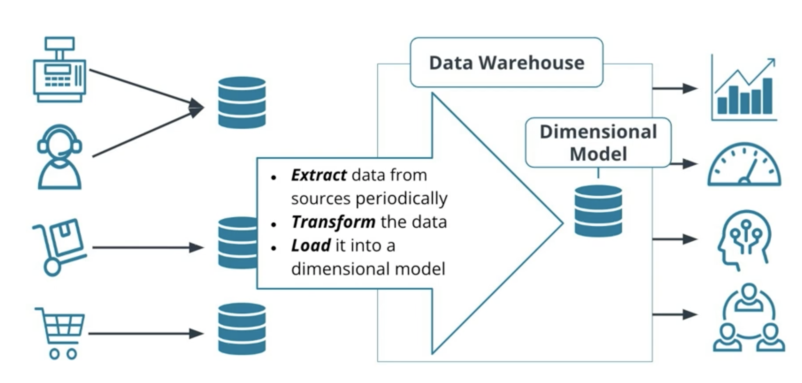
</figure>

#### Technical Perspective

Extract the data from the source systems used for operations, transform the data, and load it into a dimensional model.

<figure>
  
</figure>

##### Characteristics of Kimball Bus Architecture

- Results in a common dimension data model shared by different departments.
- Data is not kept at the aggregated level, but rather at the atomic level.
- Organized by business processes, and used by different departments.

<figure>
  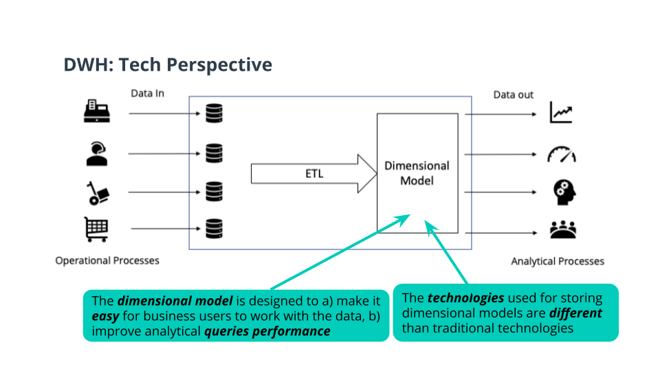
</figure>

### ETL and Dimensional Modelling

3NF use lot of expensive joins and hard to explain to business users. While dimensional modelling such as star schema uses joins with dimensions which is good for OLAP(not for OLTP).

**Goals of the star schema**:

- Easy to understand
- Fast analytical query performance

**Fact Tables**:

- Record business events, like an order, a phone call, a book review
- Fact tables columns record events recorded in quantifiable metrics like - quantity of an item, duration of a call, a book rating

**Dimension Tables**:

- Record the context of the business events e.g. who, what, where, why, etc.
- Dimension tables columns contain attributes like the store at which an item is purchased or the customer who made the call, etc.

Example:

<figure>
  
</figure>

### Exploratory Data analysis

**How to use iPython to write SQL in Python**:

- load ipython-sql: **%load_ext sql**
- To execute SQL queries, prepend your SQL statements with either of these options:
  1. %sql
     - For a single line SQL query
     - Use **$** to access a python variable
  2. %%sql
     - For a multi-line SQL query
     - You will NOT be able to access a python variable using $
- Running a connection string like: *postgresql://postgres:postgres@db:5432/pagila* connects to the database

**Notes**:

- [Sakila](https://video.udacity-data.com/topher/2021/August/61120e06_pagila-3nf/pagila-3nf.png) is a sample database created by MySql.
- The postgresql version of it is called [Pagila](https://github.com/devrimgunduz/pagila).

**Exercise**: [Exploratory Data Analysis](exercises/1_Exploratory_Data_Analysis.ipynb) (Refer step 1 to step 3)

### Dimensional Modelling

**Exercise**: [Dimensional Modeling](exercises/2_Dimensional_Modeling.ipynb) 

### ETL

**Exercise**: [ETL](exercises/3_ETL.ipynb)

### OLAP Cubes

- Once we have a star schema, we can create OLAP cubes.
- An OLAP cubes are queries that return multiple dimensions of data in a fact and dimensional dataset.
- Dimensions: Movie, Branch, Month
- Easy to communicate to business users
- Can perform Roll Up, Drill Down, Slice and Dice operations on OLAP cube dimensional data.
- OLAP Cube Operations
  - **Roll-up**: Aggregates or combines values and reduces number of rows or columns. eg: sum up the sales of each city by country. eg. US, France
  - **Drill-down**: Decomposes values and increases number of rows or columns. Which means we are going to take each city and decompose it. eg. to districts.
  - With Rolling up we get fewer values. But when drilling down we ge more values.
  - **Slice**: Reducing N dimensions to N-1 dimensions by restricting one dimension to a single value. eg: month='MAR'
  - **Dice**: Same dimensions but computing a sub-cube by restricting some of the values of the dimensions. eg: month in ['Feb', 'March'] and movie in ['Avtar', 'Batman'] branch = 'NY'
  - **Grouping Sets**: Group by CUBE (dim1, dim2, ..), produces all combinations of different lengths in one go. This view could be materialized in a view and queried, which would save lots of repetitive aggregations.
    - GROUP by CUBE Statement
      - Do one pass through the facts table
      - Aggregate all possible combinations.
  - **Cube() function**:
    - Often for 3 dimensions, you want to aggregate a fact by multiple dimensions
    - Equivalent to *grouping sets ()* but no need to specify the combinations of columns.

<figure>
  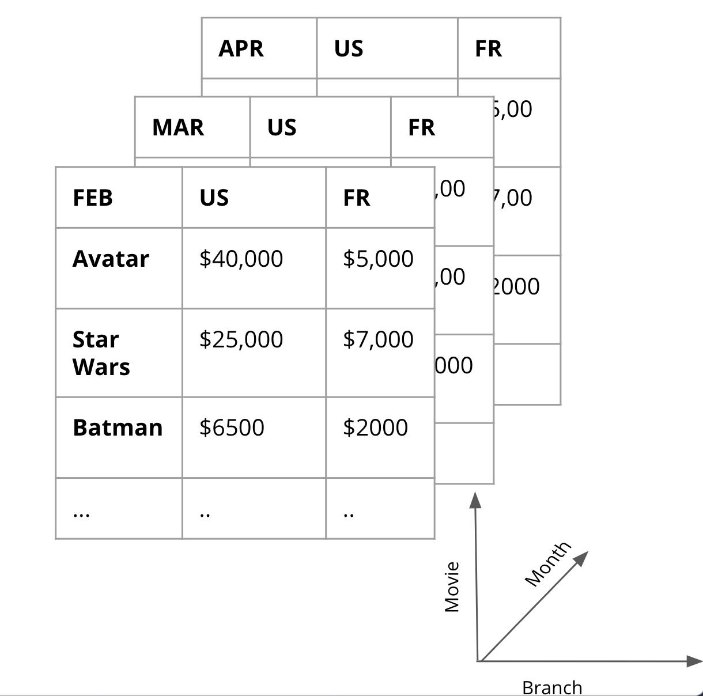
</figure>

**Exercises**:

- [Roll-up and Drill-down](exercises/4_Roll_up_and_Drill_Down.ipynb)
- [Slicing and Dicing](exercises/5_Slicing_and_Dicing.ipynb)
- [Grouping Sets](exercises/6_Grouping_Sets.ipynb)
- [Cube](exercises/7_Cube.ipynb)
- [OLAP Cubes all exercises](exercises/8_OLAP_Cubes_all.ipynb)

## ETL and Data Warehouse Technology in the Cloud

You will use several technologies when you’re building data warehouse solutions in a cloud environment.

You'll be working with:

- **Database storage technologies** for
  - Ingesting data
  - Making it available to analytics consumers.
- **Data pipeline technologies** to move data 
  - Frm source to warehouse
  - Between the stages of the Extract, Transform and Load (ETL) processes.
- End-to-end data warehouse solution that provides the ability to manage the various parts of a data warehouse from a single application.

Modern cloud infrastructures allow data warehouses to be scaled on-demand in response to changing needs.

Some of the key benefits of moving to cloud data warehouses from on-premise include:

- **Scalability**: large amounts of data can be loaded into the data warehouse environment, processed, and stored faster and with relative ease.
- **Flexibility**: ability to add and remove different types of resources from data pipelines as needed. This allows for flexibility in the process as business needs change.
- **Cost shifting**: is a result of leveraging cloud database technology to perform the costly and time-consuming transformation of data as the last part of the process rather than doing it earlier as is typical with on-premise data warehouses. By pushing it later, the business can prioritize which transforms they want to complete “just in time” for the business.

### From ETL to ELT

Traditional ETL models have worked for decades but the introduction of massive scalability through cloud data warehousing has allowed us to flip the Transform and Load steps.

- **ETL**: Transformation happens on an intermediate server
- **ELT**: Transformation happens on the destination server. Data are loaded into the destination using either raw data or staging tables.

The benefits of doing ELT include:

- **Scalability**: massive amounts of data can be loaded into the data warehouse environment with relative ease.
- **Flexibility**: the Transform step takes place using the same tech stack as the data warehouse runs on allowing for more flexibility in the process as business needs change.
- **Cost shifting**: the Transform step is often the most costly and by doing it last, Data Engineers can perform Just In Time transformations to meet the highest priority business needs first.
- Better performance for large datasets
- More flexibility for unstructured (NoSQL) datasets

Read: [Data loading strategies for dedicated SQL pool in Azure Synapse Analytics](https://learn.microsoft.com/en-us/azure/synapse-analytics/sql-data-warehouse/design-elt-data-loading)

### Cloud Managed SQL Storage

Data Warehouses in the cloud leverage many of the same SQL style, relational databases that are used for OLTP systems.

- Oracle
- Microsoft SQL Server
- PostgreSQL
- MySQL
- MariaDB

The major cloud providers provide all of these databases as managed databases meaning the user doesn't have to manage the hardware resources to gain optimal performance.

- **Microsoft Azure**
  - Azure SQL Database (MS SQL Server)
  - Azure Database for MySQL
  - Azure Database for MariaDB
  - Azure Database for PostgreSQL
- **GCP**
  - Cloud SQL (MySQL, PostgreSQL, and MS SQL Server)
- **AWS**
  - Amazon RDS (MySQL, PostgreSQL, MariaDB, Oracle, MS SQL Server)

### Cloud Managed NoSQL Storage

ELT makes it easier to use many NoSQL database management systems in Data Warehousing scenarios. These database come in many flavors such as:

- Key value
- Document
- Column oriented
- Graph
- Time series

There are two primary ways cloud service providers offer NoSQL database systems:

- **Platform API**: a single platform provides multiple APIs to various types of NoSQL databases.
- **Individual Services**: each type of NoSQL database is offered as a separate services.

Each of the major cloud providers offers a variety of managed NoSQL databases:

- **Azure CosmosDB**
  - Gremlin - graph database
  - MongoDB - document
  - Cassandra - column oriented
- GCP
  - Big Table - column oriented
  - Firestore - document
  - MongoDB Atlas - document
- AWS
  - DynamoDB - Key value
  - DocumentDB - document
  - Keyspaces = column oriented
  - Neptune - graph
  - Time stream - time series

### Cloud ETL Pipeline Services

ETL / ELT processes rely on data pipelines often built using cloud-based tools.

Major Cloud providers

- Azure Data Factory
- AWS Glue
- GCP Dataflow

In addition to these tools, a large number of companies offer cloud-based tools for solving ETL / ELT challenges. Some of the major tool providers in this space are:

- Informatica
- Talend
- Xplenty
- Matillion

One advantage of doing ELT over ETL is the ability to load large amounts of data quickly. One excellent example of this is ingesting streaming data. In modern architectures, this streaming data is often coming from Internet of Things (IoT) devices; however, it could be coming from more traditional sources such as server or transaction logs.

Each of the major cloud platforms has offering for ingesting large amounts of streaming data:

- Azure - Streaming Analytics
- AWS - Kinesis
- GCP - Dataflow

### Cloud Data Warehouse Solutions

Modern cloud data warehouse solutions seamlessly combine elements from Cloud Storage and Cloud Pipelines with powerful analytics capabilities. Each of the three major cloud providers has its own flavor of Cloud Data Warehouse that works seamlessly with its other cloud data engineering offerings.

- Azure Synapse
- Amazon Redshift
- GCP Big Query

## AWS Data Warehouse Technologies

### Using AWS Data Services

- AWS is major provider in cloud computing industry
- \> 140 services in compute, storage, databases, networking, developer tools, security etc.
- Access services via:
  - AWS management console
  - Command Line Interface(CLI)
  - Software Development Kits(SDK)

### Redshift Exercise: Create an IAM Role

To create a role:

1. In AWS management console, navigate to the IAM service dashboard.
2. In the left navigation pane, choose **Roles**.
3. Choose **Create role**.
4. In the **AWS Service** group as the trusted entity, and choose **Redshift service**.
5. Under **Select your use case**, choose **Redshift - Customizable**, and then Click Next.
6. On the **Attach permissions policies** page, search for and select the **AmazonS3ReadOnlyAccess** policy, and then click on the Next.
7. For Role name, enter *myRedshiftRole*. Optionally add tag. Then choose *Create Role*.
8. Wait for role to be created with success message: *The role myRedshiftRole has been created*

Official Docs:

- [Creating IAM roles](https://docs.aws.amazon.com/IAM/latest/UserGuide/id_roles_create.html)
- [Getting started with Amazon Redshift](https://docs.aws.amazon.com/redshift/latest/gsg/getting-started.html)

### Redshift Exercise: Create Security Group

> A security group will act as firewall rules for the Redshift cluster to control inbound and outbound traffic.

Create a security group that will be used later to authorize access to Redshift cluster.

1. Navigate to the **EC2 service**
2. Under **Network and Security** in the left navigation pane, select **Security Groups**. Click the **Create Security Group** button to launch a wizard.
3. In the wizard enter basic details:
   - Security Group name: *redshift_security_group*
   - Description: *Authorize redshift cluster access*
   - VPC: Choose the default VPC. It is a VPC in a default region, and has a public subnet in each Availability Zone. If a default VPC doesn't show up, [create a default VPC](https://docs.aws.amazon.com/vpc/latest/userguide/default-vpc.html#create-default-vpc).
4. In the Inbound rules section, click on **Add Rule** and enter the following values:
   - Type: Custom TCP
   - Protocol: TCP
   - Port range: 5439 (The default port for Amazon Redshift is 5439)
   - Source type: Custom
   - Source: 0.0.0.0/0 (anywhere in the world): not recommended.  In a real environment, we would create inbound rules based on our own network settings.
5. Outbound rules allow traffic to anywhere by default.
6. Click on the **Create security group** button at the bottom.

Official Docs:

- [Created traffic to resources using security groups](https://docs.aws.amazon.com/vpc/latest/userguide/VPC_SecurityGroups.html)

### Redshift Exercise: Create an IAM User

create an IAM user that you will use to access your Redshift cluster.

1. Navigate to the **IAM console**. In the left navigation pane, choose Users, and click on the Add User button. It will launch a new wizard.
2. Set user details: Enter a name for your user , say *airflow_redshift_user*, and choose **Programmatic access**. Then click on the **Next: Permissions** button.
3. Set permissions: Choose Attach existing policies directly option.
   - Search for redshift and select AmazonRedshiftFullAccess.
   - Then, search for S3 and select AmazonS3ReadOnlyAccess.
   - After selecting both policies, choose Next: Tags. Skip this page and choose Next: Review.
4. Review choices and finally click on the Create user button.
5. Save your credentials securely.

Official Docs:

- [Creating an IAM user in your AWS account](https://docs.aws.amazon.com/IAM/latest/UserGuide/id_users_create.html)

### Redshift Exercises: Launch a Redshift cluster

Create cluster by going to Amazon Redshift console:

1. First create subnet group if not exits: choose default vpc and click add all the subnets for this VPC
2. Go to cluster: Click Create cluster
3. Choose production
4. Choose default config node, vCPUS and storage.
   - 1 node of dc2.large hardware type. It is a high performance with fixed local SSD storage
   - 2 vCPUs
   - 160 GB storage capacity
5. Choose default values for database configuration:
   - database name: dev
   - database port: 5439
   - Master username: awsuser
   - Master user password: enter password
6. Choose the IAM role created earlier, *myRedshiftRole*, from the drop-down and click on the Associate IAM role button.
7. Toggle the button to turn off the "use defaults" feature, and expand the Network and security section. Choose the following values:
   - Virtual private cloud (VPC): Default VPC
   - VPC security groups: Choose the redshift_security_group created earlier.
   - Cluster subnet group: Choose the one create earlier
   - Availability Zone: No preference
   - Enhanced VPC routing: Disabled
   - Publicly accessible: Enable
8. Review your Cluster configuration and click on the Create cluster button at the bottom. Wait for cluster to be created and status changed to *Available*.

**Delete** the cluster after user for cost savings:

1. Select check box near cluster
2. Choose delete from actions menu
3. Choose *Create final snapshot* to restore it from later
4. Click Delete cluster

Official Docs:

- [Bringing your own data to Amazon Redshift](https://docs.aws.amazon.com/redshift/latest/gsg/bring-own-data.html)

### AWS S3

Create a Bucket:

1. In S3 Dashboard, create bucket.
2. Provide a unique name and choose required region
3. Choose public visibility
4. Disable bucket versioning, default encryption
5. Click **Create bucket**

Official Docs:
- [Getting started with Amazon S3](https://docs.aws.amazon.com/AmazonS3/latest/userguide/GetStartedWithS3.html)

### AWS RDS Database

AWS Relational Database Service(RDS) is a managed relational database service. It manages common database administration tasks, resizes automatically, and is cost-friendly.

Create PostgresSQL database:

1. In RDS console, choose the Databases menu item on the left navigation pane, and click on the **Create Database** button.
2. Choose a database creation method(Standard create/Easy create): Select **standard create**
3. Select **PostgreSQL** from **Engine Options**.
4. **Templates**: Use either the RDS Free Tier or Dev/Test template.
5. **Settings**: DB instance identifier, such as postgreSQL-test, and master credentials (username and a password).
6. **DB instance class**: Choose Burstable classes
7. **Storage** and **Availability & durability**: Choose defaults
8. **Connectivity**:
   - VPC: Default VPC
   - Subnet group: default
   - Public access: Yes
   - VPC security group: choose default one or create new one.
   - Availability zone: No preference
   - Database prot: 5432(default)
9. Leave the values default for the Database authentication section.
10.**Additional configuration**:
   - Provide the database name.
   - In the Backup section and select 1 day, since this is for demonstration purposes.
11.Leave the default values for the rest and click on the **Create database** button on the bottom right.
12.Wait for database being created and status change to **Available**

Official Docs:

- [Creating an Amazon RDS DB instance](https://docs.aws.amazon.com/AmazonRDS/latest/UserGuide/USER_CreateDBInstance.html)

### Infrastructure As Code(IaC) on AWS: Boto3 SDK

**Boto3** is a Python SDK for programmatically accessing AWS. It enables developers to create, configure, and manage AWS services. 

Advantages of IaC:

- **Sharing**: easily share all the step with others
- **Reproducibility**: can make sure that no steps are skipped.
- **Multiple Deployments**: can create identical environments easily and efficiently.
- **Maintainability**: can keep track of changes by comparing code.

[Boto3 Documentation](https://boto3.amazonaws.com/v1/documentation/api/latest/index.html)

**Exercise**: [Infrastructure as a code](exercises/9_Infra_as_a_Code.ipynb)

## Implementing a Data Warehouse on AWS

### Amazon Redshift

<figure>
  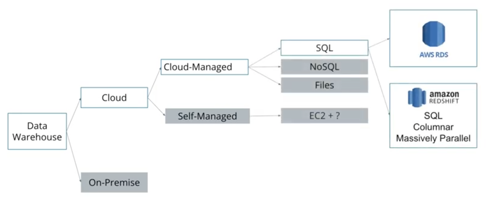
</figure>

- Redshift is a column-oriented RDBMS
- Best suited for storing OLAP workloads
- Most relational databases will execute multiple queries in parallel if they have access to many cores or servers. But each query will run on only on one CPU.
- But for data warehouses need massive parallel processing(MPP).
- MPP databases like Amazon Redshift parallelize the execution of single query on multiple CPUs on multiple machines.
- Tables in MPP databases are partitioned into smaller partitions and distributed across CPUsand each CPU has its own associated storage. One query can process whole table in parallel and each CPU is processing only one partition of the data.
- Redshift is composed of 1 Leader node and one or more compute nodes.
- Client applications talk to the leader node using protocols like JDBC or ODBC.

### Redshift Architecture**

<figure>
  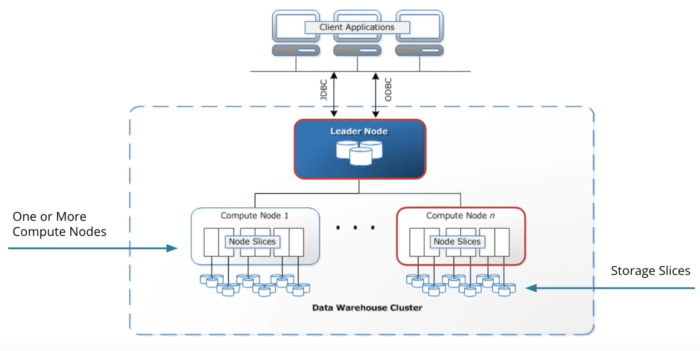
</figure>

**LeaderNode**:

- Coordinates compute nodes
- Handles external communication
- Optimizes query execution

**Compute Nodes**:

- Each with own CPU, memory, and disk (determined by the node type)
- Scale up: get more powerful nodes
- Scale out: get more nodes
- Each node is an AWS EC2 instance.

**Node Slices**:

- Each compute node is logically divided into a number of slices
- Each slice in a Redshift cluster is at least 1 CPU with dedicated storage and memory for the slice.
- A cluster with n slices can process n partitions of tables simultaneously
- The sum of all slices across all compute nodes is the unit of parallelization.

#### Redshift Node Types and Slices

<figure>
  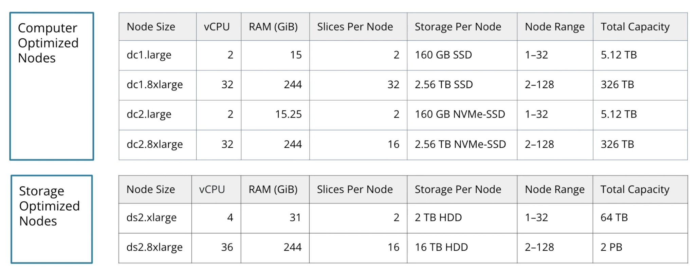
</figure>

**Compute Optimized Nodes**:

- Start with these for lower costs and a capacity of 5 terabytes

**Storage Optimized Nodes**:

- Higher costs, not as fast, but higher capacity

### Ingesting Data at Scale

**Data Warehouse ETL**:

<figure>
  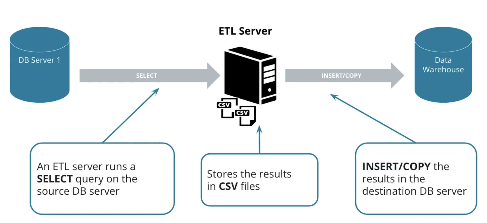
</figure>

**ETL Implementation with AWS**:

<figure>
  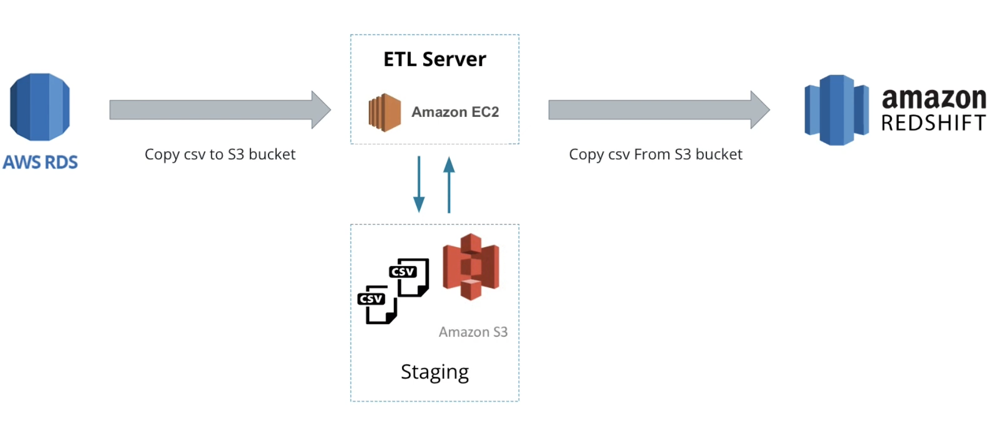
</figure>

- Here the purpose of EC2 instance is to act as a client to RDS and Redshift to issue COPY commands.
- The Advantage of using S3 is that it offers a very reliable, scalable and worry-free storage solution
- For very small data, we can copy data directly from the EC2 machine instead of using S3.

<figure>
  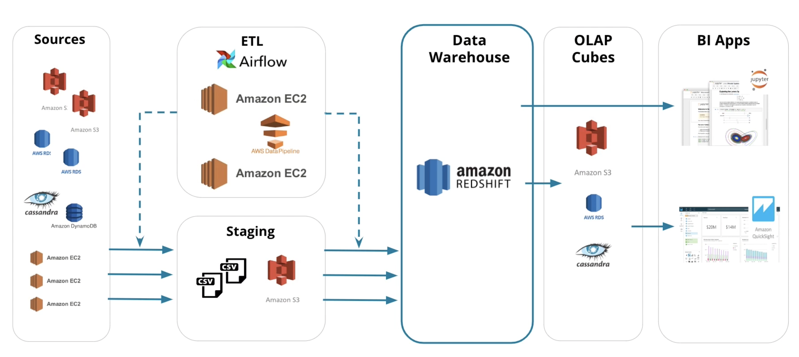
</figure>

#### Transferring Data from an S3 Staging Area to Redshift**

Use the COPY Command
  
- Inserting data row by using INSERT will be very slow

If the file is large:

- It is better to break it up into multiple files
- Ingest in Parallel: methods to know how group of files belong together
  - File have Common prefix
  - Use Manifest file
  - If we prefix or manifest, the COPY command will ingest the file in parallel automatically.

Other considerations:

- Better to ingest from the same AWS region as that of Redshift cluster.
- Better to compress all the CSV files

Can also specify the delimiter to be used

**Example of Ingesting with Prefix**:

<figure>
  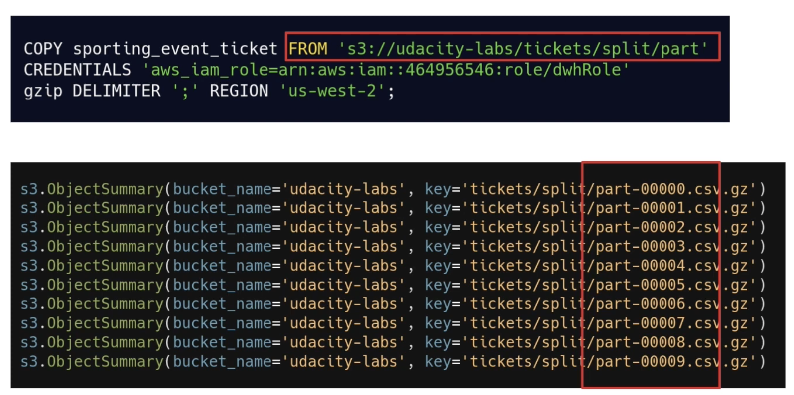
</figure>

Here Redshift will parallelize the processing of the data on the prefix. That's all 10 files will get processed in parallel. It will spin up a number of workers and these compute nodes can ingest the file into Redshift in parallel.

**Example of Ingesting with Manifest file**:

<figure>
  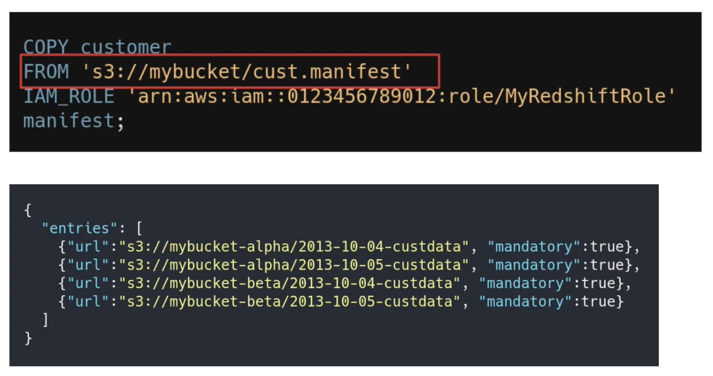
</figure>

**Notes**:

- In the ETL implementation on AWS, the purpose of EC2 instance is to act as a client to RDS and Redshift to issue COPY commands.

**Exercise**: [ETL in Redshift](exercises/10_Parallel_ETL.ipynb)

### Optimizing Table Design with Distribution Styles

If you know about the frequent access pattern of a table, you can choose a more performant strategy by configuring different distribution options for your cluster.

Two partition strategies are:

- Distribution style
  - EVEN distribution
  - ALL distribution
  - AUTO distribution
  - KEY distribution

#### EVEN Distribution

- Round-robin over all slices to achieve load-balancing
- Good if a table won't be joined

<figure>
  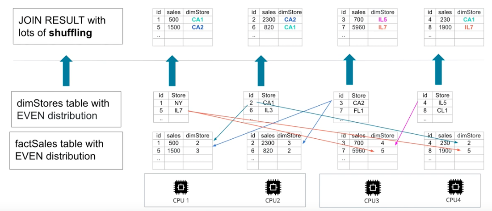
</figure>

#### ALL Distribution

- Small tables replicated on all slices(Broadcasting) to speed up joins.
- Used frequently for dimension tables.

<figure>
  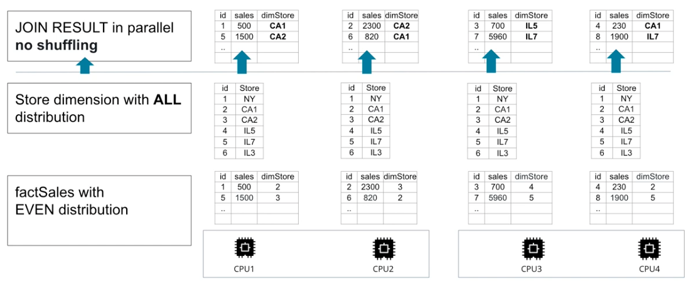
</figure>

#### AUTO Distribution

- Leave decision to Redshift.
- Small tables are distributed with ALL strategy.
- Large tables are distributed with EVEN strategy.

#### Key Distribution

- Rows having similar values are placed in the same slice.
- Sometimes lead to skew distribution because some keys are more frequent than others.

<figure>
  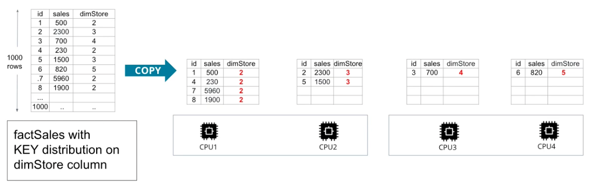
</figure>

**Sorting key**:

- Define columns as sort key
- When data is loaded, rows are sorted before distribution to slices.
- This minimizes query time since each node already have contiguous ranges of rows based on the sorting keys.
- It's useful for queries that are frequently used in **ordery by** queries which are typically found in fact tables. eg. date dimension and its corresponding foreign key in the fact table.
- A column can be both distribution key and sorting key.

<figure>
  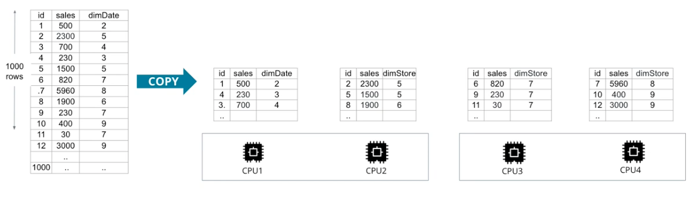
</figure>

**Query syntax**:

<figure>
  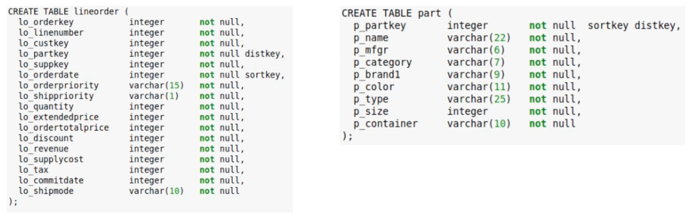
</figure>

**Exercise**: [Optimizing Redshift Table Design](exercises/11_Optimizing_Redshift_Table_Design.ipynb)

## Project Data Warehouse

### Requirement

*A music streaming startup, Sparkify, has grown their user base and song database and want to move their processes and data onto the cloud. Their data resides in S3, in a directory of JSON logs on user activity on the app, as well as a directory with JSON metadata on the songs in their app.*

*As their data engineer, you are tasked with building an ETL pipeline that extracts their data from S3, stages them in Redshift, and transforms data into a set of dimensional tables for their analytics team to continue finding insights into what songs their users are listening to.*

### Project Overview

In this project,

- Apply what you've learned on data warehouses and AWS to build an ETL pipeline for a database hosted on Redshift.
- To complete the project, you will need to load data from S3 to staging tables on Redshift and execute SQL statements that create the analytics tables from these staging tables.

**Project Code**: [Data warehouses](project/README.md)

**References**:

- [Redshift Create Table Docs](https://docs.aws.amazon.com/redshift/latest/dg/r_CREATE_TABLE_NEW.html)
- [A guide on Markdown Syntax](https://www.markdownguide.org/basic-syntax/)
- [Million Song Dataset](http://millionsongdataset.com/)
- [Event Simulator](https://github.com/Interana/eventsim)