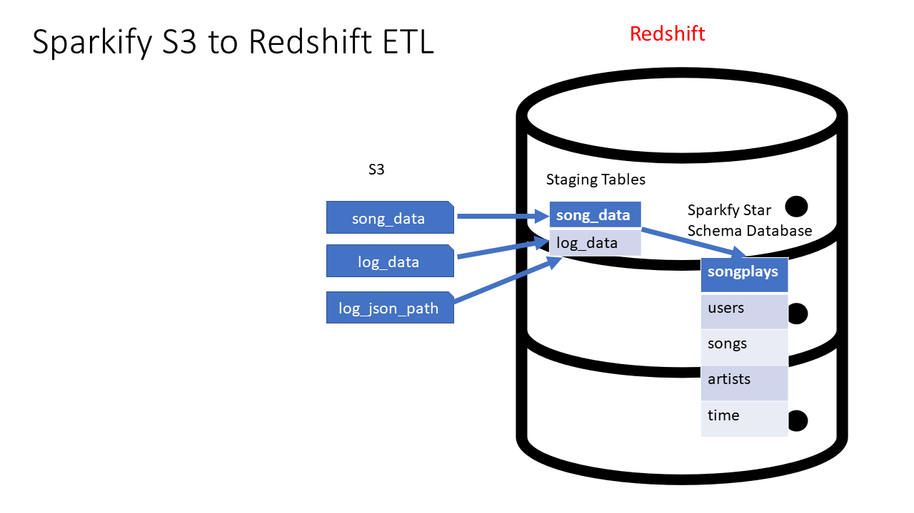

# Project: Data Warehouse

## Introduction

A music streaming startup, Sparkify, has grown their user base and song database and want to move their processes and data onto the cloud. Their data resides in S3, in a directory of JSON logs on user activity on the app, as well as a directory with JSON metadata on the songs in their app.

As their data engineer, you are tasked with building an ETL pipeline that extracts their data from S3, stages them in Redshift, and transforms data into a set of dimensional tables for their analytics team to continue finding insights into what songs their users are listening to.

<figure>
  
</figure>

## Database schema design

### Staging tables

- **staging_events**: stores data extracted from JSON logs on user activity. Columns: *artist, auth, firstName, gender, itemInSession, lastName, length, level, location, method, page, registration, sessionId, song, status, ts, userAgent, userId*
- **staging_songs**: stores data extracted from JSON metadata on the songs in the app. Columns: *num_songs, artist_id, artist_latitude, artist_longitude, artist_location, artist_name, song_id, title, duration, year*

### Analytical tables

- **Fact Table**
  - **songplays**: records in event data associated with song plays i.e. records with page NextSong. Columns: *songplay_id, start_time, user_id, level, song_id, artist_id, session_id, location, user_agent*
- **Dimension Tables**
  - **users**: users in the app. Columns: *user_id, first_name, last_name, gender, level*
  - **songs**: songs in music database. Columns: *song_id, title, artist_id, year, duration*
  - **artists**: artists in music database. Columns: *artist_id, name, location, latitude, longitude*
  - **time**: timestamps of records in songplays broken down into specific units. Columns: *start_time, hour, day, week, month, year, weekday*

## ETL pipeline

- [create_tables.py](create_tables.py) will drop all existing tables and create tables a per the queries mentioned in [sql_queries.py](sql_queries.py).
- [etl.py](etl.py) copy data from s3 to staging table and then populate *fact* and *dimension* tables.

[main.ipynb](main.ipynb) for running complete project flow including setting up aws resources, running aforementioned etl pipeline and cleaning up resources.
