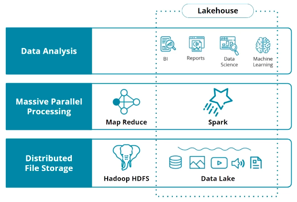
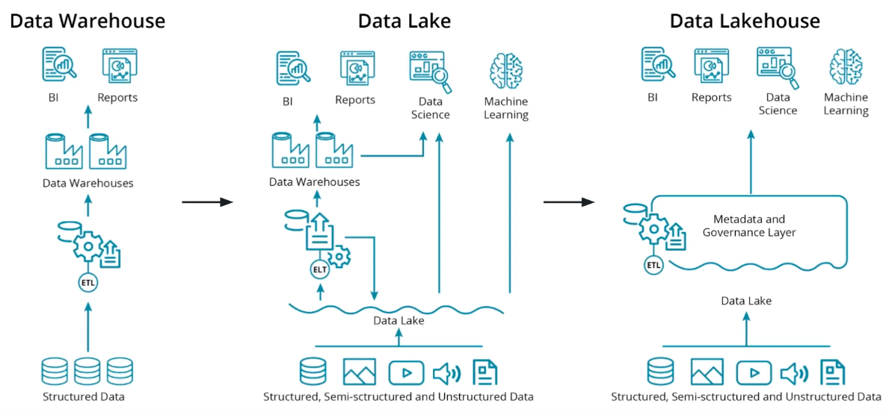
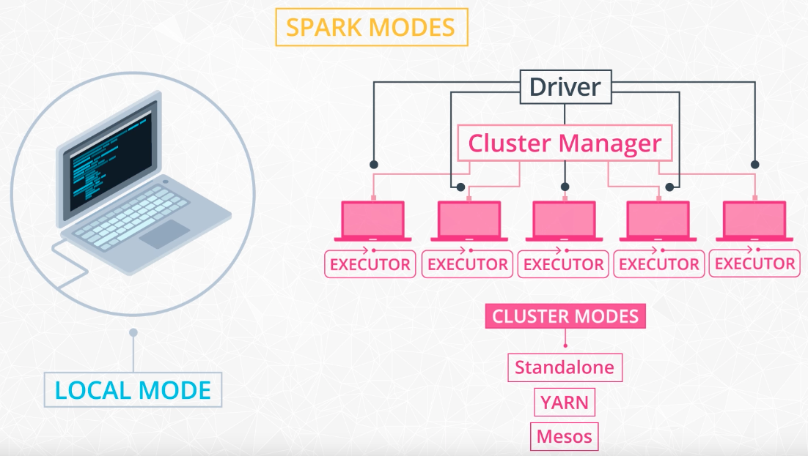
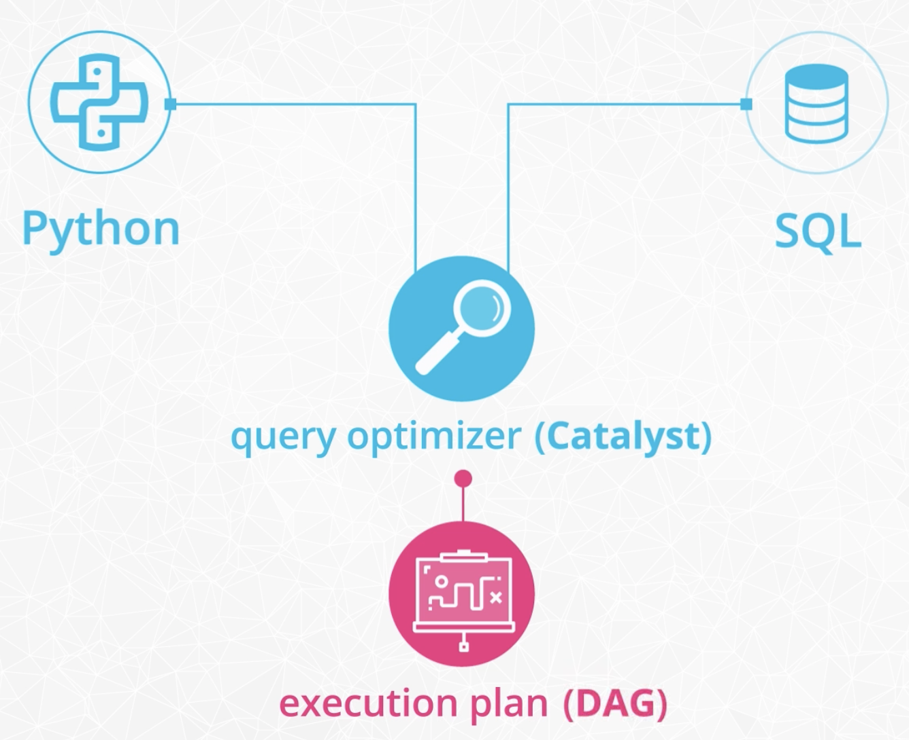
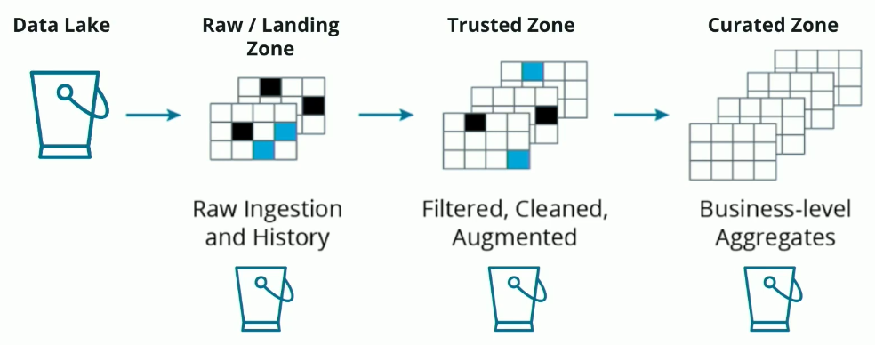
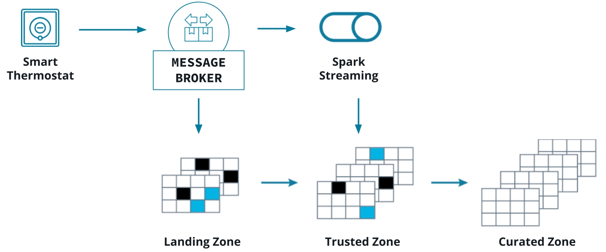

# Spark and Data Lakes

## Introduction to Spark and Data Lakes

This course contains hands-on exercises and a project to develop skills in the following areas:

- Big Data Engineering and Ecosystem
- Apache Spark
- Using Spark with Amazon Web Services (AWS)
- Building a data lake house on AWS

<hr style="border:2px solid gray">

## Big Data Ecosystem, Data Lakes and Spark

- The modern big data ecosystem is an evolution of data processing on distributed architecture necessary to handle the sheer volume of data.
- The job of data engineer is to skillfully use modern tools and techniques to create the big data ecosystem.

### Evolution of Big Data Ecosystem

<figure>
  
</figure>

- Early efforts at processing large amounts of structured, semi-structured, and unstructured data led to the development of Hadoop. Hadoop incorporates two key components:
  - **The Hadoop Distributed File System (or HDFS)** provides distributed storage with high-throughput access to data.
  - **MapReduce** provides a way to conduct massive parallel processing for large amounts of data.
- Next evolution was **Apache Spark**
  - Built on ideas of Hadoop
  - Provides multiple APIs for processing data
  - Provides interactive interface for iteratively developing data engineering/science solutions.
- Hadoop + Spark led to the development of **Data lakes**
  - To process large amounts of both structured and unstructured data.
- Last step in the evolution is the **Lake house architecture**
  - Combine the strengths of both data lakes and data warehouses.

### From Hadoop to Data Lakehouse

<figure>
  
</figure>

- Data warehouses are based on specific and explicit data structures that allow for highly performant business intelligence and analytics but they do not perform well with unstructured data.
- Data lakes are capable of ingesting massive amounts of both structured and unstructured data with Hadoop and Spark providing processing on top of these datasets.
- Data lakes have several shortcomings
  - They are unable to support transactions and perform poorly with changing datasets.
  - Data governance became difficult due to the unstructured nature of these systems.
- Modern lakehouse architectures seek to combine the strengths of data warehouses and data lakes into a single, powerful architecture.

### The Hadoop Ecosystem

- **Hadoop**: an ecosystem of tools for big data storage and data analysis.
- **Hadoop MapReduce**: a system for processing and analyzing large data sets in parallel.
- **Hadoop YARN**: a resource manager that schedules jobs across a cluster.
- **Hadoop Distributed File System (HDFS)**: a big data storage system that splits data into chunks and stores the chunks across a cluster of computers.
- **Apache Pig**: a SQL-like language that runs on top of Hadoop MapReduce
- **Apache Hive**: another SQL-like interface that runs on top of Hadoop MapReduce.

#### Spark vs Hadoop

- Spark is another big data framework.
- Spark contains libraries for data analysis, machine learning, graph analysis, and streaming live data.
- Spark is generally faster than Hadoop. This is because Hadoop writes intermediate results to disk whereas Spark tries to keep intermediate results in memory whenever possible.
- Hadoop ecosystem includes a distributed file storage system called HDFS. Spark, on the other hand, does not include a file storage system. Spark can read in data from other sources as well.

#### Streaming Data

- **Use case**: when we want to store and analyze data in real-time.
- Popular streaming libraries:
  - [Spark Streaming](https://spark.apache.org/docs/latest/streaming-programming-guide.html)
  - [Storm](https://storm.apache.org/)
  - [Flink](https://flink.apache.org/)
- Storm and Flink are designed for fast streaming. Better than Spark streaming.

### MapReduce

- **MapReduce**: a programming technique for manipulating large data sets.
- **Hadoop MapReduce**: an implementation of MapReduce.
- Steps:
  1. Divide the large dataset and distributing the data across a cluster.
  2. *Map*: data is analyzed and converted into a (key, value) pair.
  3. *Shuffle*:These key-value pairs are shuffled across the cluster so that all keys are on the same machine.
  4. *Reduce*: the values with the same keys are combined together.

**Exercise**: [Map Reduce](exercises/1_mapreduce_practice.ipynb)

### Spark

Spark is currently one of the most popular tools for big data analytics. It's a

- Data engineering tool
- Data analytics tool
- Data science tool

Apache Spark can be used to perform data engineering tasks for building both data lakes and lakehouse architectures.

#### Spark Cluster

Most computational frameworks are organized into a **master-worker** hierarchy:

- The master node is responsible for orchestrating the tasks across the cluster
- Workers are performing the actual computations

<figure>
  
</figure>

There are four different modes to setup Spark:

1. **Local Mode**:
   - Everything happens on a single machine. So, while we use spark's APIs, we don't really do any distributed computing.
   - Useful to learn syntax and to prototype your project.
2. **Cluster Modes**:
   - Distributed and declare a cluster manager.
   - The cluster manager is a separate process that monitors available resources and makes sure that all machines are responsive during the job.
   - There are three different options of cluster managers.
     a. *Standalone*
        - Spark's own cluster manager.
        - There is a Driver process which act as the master and is responsible for scheduling tasks.
     b. *YARN*
        - From Hadoop project
     c. *Mesos*
        - Open-source manager from UC Berkeley's AMPLab Coordinators.

#### Spark Use Cases

Resources about Spark use cases:

- [Data Analytics](https://spark.apache.org/sql/)
- [Machine Learning](https://spark.apache.org/mllib/)
- [Streaming](https://spark.apache.org/streaming/)
- [Graph Analytics](https://spark.apache.org/graphx/)

**When to Use Spark**:

Spark is meant for big data sets that cannot fit on one computer. If data sets fit on local computer, following methods can be used:

- AWK - a command line tool for manipulating text files
- Python or R libraries
- Even if data is little bigger than memory, Pandas can read data in chunks.

Other possible methods:

- If data is stored in relational databases, can leverage SQL to extract, filter and aggregate the data.
- [SQLAlchemy](https://www.sqlalchemy.org/) provides an abstraction layer to manipulate SQL tables with generative Python expressions. It enables to leverage pandas and SQL simultaneously.

#### Spark's Limitations

- Spark Streaming’s latency is at least 500 milliseconds since it operates on micro-batches of records, instead of processing one record at a time.
- Streaming tools such as **Storm, Apex or Flink** are sutiable for low latency applications.
- Spark only supports ML algorithms that scale linearly with the input data size.

### Data Lakes

- In data warehouses data has to be structured going in and out of it.
- A data lake on the other hand, pours all of the data into a single repository, ready to be consumed by whoever and wherever they need.
- Data warehouses consist of only highly structured data that is suitable for business intelligence and reporting needs.
- Data lakes provide the ability to serve up both structured and un-structured data from a single data store.
- Key features of data lakes include:
  - Lower costs associated with using big data tools for ETL / ELT operations.
  - Data lakes provide schema-on-read rather than schema-on-write which lowers the cost and work of ingesting large amounts of data.
  - Data lakes provide support for structured, semi-structured, and unstructured data.

### Data Lakehouse

Though data lakes provide huge improvement in handling both structured and un-structured data, With the need to ingest a large amount of unstructured data, we lost:

- Atomic transactions: failed production jobs left data in a corrupted state.
- Quality enforcement: inconsistent and therefore unusable data.
- Consistency in data structures: impossible to stream and batch process data while ingesting.

Lake house architecture overcome these limitations with the creation of a **metadata** and **data governance layer** on top of the data lake.

One of the important features of a lakehouse architecture is the ability to quickly ingest large amounts of data and then incrementally improve the quality of the data.

The key difference between data lakes and data lakehouse architectures is the inclusion of the metadata and governance layer which provides atomicity, data quality, and consistency for the underlying data lake.

<hr style="border:2px solid gray">

## Spark Essential

### The Spark DAG

- In distributed systems, a program should not rely on resources created by previous executions.
- An **idempotent program** can run multiple times without any effect on the result.
- Non-idempotent programs depend on prior state in order to start executing.
- Example of relying on prior state:

```java
ledgerBalance = getLedgerBalanceFromLastRun()
ledgerBalance = ledgerBalance + getLedgerBalanceSinceLastRun()
```

- Example of avoiding prior state

```java
ledgerBalance = addAllTransactions()
```

- One goal of idempotent code is that data can be processed in parallel. This is achieved by calling the same code repeatedly in different threads and on different nodes/servers for each chunk or block of data. If each program has no reliance on prior execution, there should be no problem splitting up processing.
- Using Spark, large data can be handled using special datasets called **Resilient Distributed Datasets (RDDs)** and **DataFrames**.
- Instead of holding the data in memory, these datasets the Spark job access to the shared resources of the cluster in a very controlled way, that is managed outside of your Spark job.

```java
# Instead of doing something like this 

textFile = open("invoices.txt", "r")

# invoiceList could occupy Gigabytes of Memory
invoiceList = textFile.readlines()

print(invoiceList)

# Do something like this instead

invoiceDataFrame = spark.read.text("invoices.txt")

# Leverage Spark DataFrames to handle large datasets
invoiceDataFrame.show(n=10)
```

<figure>
  
</figure>

- Every Spark program makes a copy of its input data and never changes the original parent data.
- Because Spark doesn't change or mutate the input data, it's known as **immutable**.
- When multiple functions calls in program, Spark chaining these together so that each accomplish small chunk of work.
- Then Spark finds a more optimal execution plan.
- **Lazy evaluation**: Spark uses this programming concept. Before Spark does anything with the data in your program, it first builds step-by-step directions of what functions and data it will need. It's called **Directed Acyclic Graph (DAG).**. The reference is made to the fact that no explicit repetition is inherent in the process.
- For example, if a specific file is read more than once in your code, Spark will only read it one time.
- Spark builds the DAG from your code, and checks if it can be delayed, waiting until the last possible moment to get the data.
- Output of spark execution shows something like this: 

```bash
[Stage 20:> ======>                                         (0 + 1) / 1]
```

- This means your code is on stage 20 of its physical execution plan.
- Data is processed in parallel tasks at each stage, separated by data partitions, so data in the same partition can be processed more efficiently.

### Resilient Distributed Datasets

Spark processes data using a cluster of distributed computing resources.

1. Source data is loaded from a different sources like database.
2. Spark converts this data into an immutable collection of objects for distributed processing called a Resilent Distributed Dataset or RDD.

The features of the RDD are designed for efficient data processing; it is fault-tolerant (recomputed in case of failure), cacheable, and partitioned.

<figure>
  
</figure>

Sparks's query optimizer(Catalyst) convert code written in high level language like python/sql to DAG:

The code generated based on the execution plan operates on a lower level data abstraction called Resilient Distributed Dataset(RDD).

<figure>
  
</figure>

In Spark version 2.0 DataFrame and Datset API were unified.

**Resources**:

- [RDDs vs DataFrames and Datasets](https://www.databricks.com/blog/2016/07/14/a-tale-of-three-apache-spark-apis-rdds-dataframes-and-datasets.html)
- [RDD prgramming guide](https://spark.apache.org/docs/latest/rdd-programming-guide.html)

### PySpark and SparkSession

**PySpark**:

- Python library used to write Spark Jobs.
- Give access to Spark Data constructs like RDDs, DataFrames, Spark SQL.

**SparkContext**:

- First component of a Spark Program.
- The main entry point for Spark functionality.
- Connects the cluster with the application.
- If using lower level abstractions, will create objects with SparkContext.
- To create a SparkContext: create *SparkConf* object by specifying information about the application(eg: name) and the Master node's IP address(*local* if run in local mode).

```python
from pyspark import SparkContext, SparkConf

configure = SparkConf().setAppName("app name").setMaster("IP Address")

sc = SparkContext(conf = configure)
```

**SparkSession**:

- Spark SQL equivalent which is used to read data frames.
- To create a SparkSession, use parameters/functions like *getOrCreate* which is used to retrieve the SparkSession if already existing or create new one.

```python
from pyspark import SparkSession

spark = SparkSession.builder.appName("app name").config("config option", "config value").getOrCreate()
```

### Maps and Lambda Functions

**Map**:

- Makes copy of the original input data and transforms according to the function passed to *map*.

eg:

```python
names = ["john", "bob", "martin", "Jannet", "Silvia"]

# Convert python list to distributed dataset for processing using Spark
distributed_names_rdd = spark.SparkContext.parallelize(names)

# function for converting to lower
def convert_to_lower(name):
  return name.lower

# Use Spark function map to apply convert_to_lower function to each item in the distributed dataset
step_to_lower = distributed_names_rdd.map(convert_to_lower)

# Spark commands are using lazy evaluation. So, the actual conversion is not happened yet. To force Spark to take some action on the data use collect function.
step_to_lower.collect()
```

**lambda**:

- Keyword for anonymous functions in python which is used to writing functional style programs.

eg:

```python
distributed_names_rdd.map(lambda name: name.lower())
```

**Exercise**: [Maps and Lambda functions](exercises/2_rdd_song_lower_case.py)

### Data Formats

Common data formats: CSV, JSON, HTML, and XML

### Distributed Data stores

- Store data in a fault-tolerant way.
- Hadoop's Distributed file system, HDFS splits file into 64/128 megabyte blocks and replicates these blocks across the cluster.
- Examples of distributed data services on cloud providers:
  - Amazon Simple Storages Sevice(S3)
  - Azure Blob Storage
  - Google Cloud Storage

### Imperative vs Declarative programming

#### Imperative programming using DataFrames and python

- Concerned with how
- Focus on exact steps, how to get to the result
- Data transformations with DataFrames

#### Declarative programming using SQL

- Concerned with what(result)
- Provides an abstraction layer for an imperative system

**Exercise**: [Reading and writing data to and fro of DataFrames](exercises/3_data_inputs_and_outputs.py)

### Data Wrangling with Spark

**Data Wrangling** includes data processing activities like cleaning, sorting, filtering and grouping data.

**General functions**:

- ```select()```: returns a new DataFrame with the selected columns
- ```filter()```: filter rows using the given condition
- ```where()```: an alias for ```filter```
- ```groupBy()```: groups the DataFrame using the specified columns for aggregations.
- ```sort()```: returns new Dataframe sorted by the specified column(s).
- ```dropDuplicates()```: returns a new DataFrame with unique rows based on all or just a subset of columns.
- ```withColumn()```: returns a new DataFrame by adding a column or replacing the existing column that has the same name.

**Aggregate functions**:

- Spark SQL provides built-in methods for the most common aggregations such as ```count()```, ```countDistinct()```, ```avg()```, ```max()```, ```min()``` etc`
- If want to use one type of aggregation, chain aforementioned aggregate methods after ```groupBy()```.
- If want to use different functions on different columns, use ```agg()```. eg: ```agg({"salary": "avg", "age": "max"})```

**User Defined Functions(UDF)**:

- Define udf method from the ```pyspark.sql.functions``` module.

eg:

```python
get_hour = udf(lambda x: datetime.datetime.fromtimestamp(x / 1000.0). hour)

user_log_df = user_log_df.withColumn("hour", get_hour(user_log_df.ts))
```

**Window Functions**:

- Way of combining the values of ranges of rows in a DataFrame.
- ```partitionBy()``` to sort and group the rows.
- ```rangeBetween()``` or ```rowsBetween()```to define how wide the window should be.

eg:

```python
windowval = Window.partitionBy("userId") \
    .orderBy(desc("ts")) \
    .rangeBetween(Window.unboundedPreceding, 0)

user_log_valid_df = user_log_valid_df \
    .withColumn("phase", Fsum("downgraded") \
    .over(windowval))
```

**Exercises**:

- [Data Wrangling](exercises/4_data_wrangling.py)
- [Data Wrangling Quiz](exercises/5_data_wrangling_quiz.py)

**Resources**:

- [Spark SQL, DataFrames and Datasets Guide](https://spark.apache.org/docs/latest/sql-programming-guide.html#spark-sql-dataframes-and-datasets-guide)
- [Spark with Python (PySpark) Tutorial](https://sparkbyexamples.com/pyspark-tutorial/)

### Spark SQL

- Query data with a declarative approach.
- Sparks provide an SQL library which let us query the DataFrames using the SQL syntax.
- Spark automatically optimizes SQL code, to speed up the process of manipulating and retrieving data.

**Exercise**: [Data Wrangling with Spark SQL](exercises/6_data_wrangling_with_spark_sql.py)

**Resources**:

- [Spark SQL built-in functions](https://spark.apache.org/docs/latest/api/sql/index.html)
- [Spark SQL guide](https://spark.apache.org/docs/latest/sql-getting-started.html)

<hr style="border:2px solid gray">

## Using Spark in AWS

### Data Lakes in AWS

- In AWS data lakes can be implemented using S3 storage.
- The very top level of S3 is called an S3 Bucket. Within a bucket, you can keep many directories and files.

### Spark in AWS

Choices for running Spark in AWS

- **EMR**:
  - AWS Managed Spark Service.
  - Scalable set of EC2 machines with pre-configured Spark.
  - No need of managing systems, only configure the necessary cluster resources.
  - HDFS is installed.
  - Billing model: EC2 costs.
- **EC2**:
  - Self installed.
  - HDFS is installed.
  - Billing model: EC2 costs.
- **Glue**:
  - Serverless Spark environment with added libraries like Glue Context and Glue Dynamic Frames.
  - Also interfaces with other AWS data services like Data Catalog and AWS Athena.
  - HDFS is installed.
  - Billing model: Job duration.

Since Spark lacks a file distribution system to organize, store and process data files, Spark tools are often installed on Hadoop because Spark can then use the Hadoop Distributed File System (HDFS).

### Introduction to Spark Glue

- Glue is an AWS Service that relies on Spark.
- We can use Glue Studio to write purely Spark scripts.

**AWS Glue configuration**:

<figure>
  
</figure>

- **Routing Table**:
  - Stores the network paths to various locations. eg: path to S3 from within VPC.
- **VPC Gateway**:
  - Entity for providing access to outside networks and resources.
  - Here to access S3 which is a shared service outside the VPC.
- **S3 Gateway Endpoint**:
  - By default, Glue Jobs cannot reach any networks outside of our Virtual Private Cloud (VPC).
  - Since the S3 Service runs in different network, we need to create an S3 Gateway Endpoint.
  - This allows S3 traffic from our Glue Jobs into our S3 buckets.
  - Once we have created the endpoint, Glue Jobs will have a network path to reach S3.

### Configure S3 VPC Gateway Endpoint

<figure>
  
</figure>

Steps to set up an S3 VPC Gateway Endpoint to create a network path for Glue to connect with S3.

**Step 1: Create an S3 Bucket**:

```bash
aws s3 mb s3://udacity-glue-spark-bucket
```

**step 2: S3 Gateway Endpoint**:

First use the AWS CLI to identify the VPC that needs access to S3:

```bash
aws ec2 describe-vpcs
```

Sample output:

```json
{
    "Vpcs": [
        {
            "CidrBlock": "172.31.0.0/16",
            "DhcpOptionsId": "dopt-00bfb659a55a2540c",
            "State": "available",
            "VpcId": "vpc-07050ed7ea6813884",
            "OwnerId": "261476836151",
            "InstanceTenancy": "default",
            "CidrBlockAssociationSet": [
                {
                    "AssociationId": "vpc-cidr-assoc-03c6c629422f76d30",
                    "CidrBlock": "172.31.0.0/16",
                    "CidrBlockState": {
                        "State": "associated"
                    }
                }
            ],
            "IsDefault": true
        }
    ]
}
```

Note the ```VpcId``` in the output.

**step 3: Routing Table**:

Identify the routing table we want to configure with VPC Gateway

```bash
aws ec2 describe-route-tables
```

Sample output:

```json
{
    "RouteTables": [
        {
            "Associations": [
                {
                    "Main": true,
                    "RouteTableAssociationId": "rtbassoc-0bcbc81c3bfc00433",
                    "RouteTableId": "rtb-0f7debbf05239e153",
                    "AssociationState": {
                        "State": "associated"
                    }
                }
            ],
            "PropagatingVgws": [],
            "RouteTableId": "rtb-0f7debbf05239e153",
            "Routes": [
                {
                    "DestinationCidrBlock": "172.31.0.0/16",
                    "GatewayId": "local",
                    "Origin": "CreateRouteTable",
                    "State": "active"
                },
                {
                    "DestinationCidrBlock": "0.0.0.0/0",
                    "GatewayId": "igw-04781bf78c9c6ed79",
                    "Origin": "CreateRoute",
                    "State": "active"
                }
            ],
            "Tags": [],
            "VpcId": "vpc-07050ed7ea6813884",
            "OwnerId": "261476836151"
        }
    ]
}
```

Look for the ```RouteTableId```

**Step 4: Create an S3 Gateway Endpoint**:

```bash
aws ec2 create-vpc-endpoint --vpc-id vpc-07050ed7ea6813884 --service-name com.amazonaws.us-east-1.s3 --route-table-ids rtb-0f7debbf05239e153
```

Sample output:

```json
{
    "VpcEndpoint": {
        "VpcEndpointId": "vpce-04fdd25ab5b2f9ffa",
        "VpcEndpointType": "Gateway",
        "VpcId": "vpc-07050ed7ea6813884",
        "ServiceName": "com.amazonaws.us-east-1.s3",
        "State": "available",
        "PolicyDocument": "{\"Version\":\"2008-10-17\",\"Statement\":[{\"Effect\":\"Allow\",\"Principal\":\"*\",\"Action\":\"*\",\"Resource\":\"*\"}]}",
        "RouteTableIds": [
            "rtb-0f7debbf05239e153"
        ],
        "SubnetIds": [],
        "Groups": [],
        "PrivateDnsEnabled": false,
        "RequesterManaged": false,
        "NetworkInterfaceIds": [],
        "DnsEntries": [],
        "CreationTimestamp": "2023-01-31T19:30:10+00:00",
        "OwnerId": "261476836151"
    }
}
```

Check the new routes created:

```bash
aws ec2 describe-route-tables
````

Sample output:

```json
{
    "RouteTables": [
        {
            "Associations": [
                {
                    "Main": true,
                    "RouteTableAssociationId": "rtbassoc-0bcbc81c3bfc00433",
                    "RouteTableId": "rtb-0f7debbf05239e153",
                    "AssociationState": {
                        "State": "associated"
                    }
                }
            ],
            "PropagatingVgws": [],
            "RouteTableId": "rtb-0f7debbf05239e153",
            "Routes": [
                {
                    "DestinationCidrBlock": "172.31.0.0/16",
                    "GatewayId": "local",
                    "Origin": "CreateRouteTable",
                    "State": "active"
                },
                {
                    "DestinationCidrBlock": "0.0.0.0/0",
                    "GatewayId": "igw-04781bf78c9c6ed79",
                    "Origin": "CreateRoute",
                    "State": "active"
                },
                {
                    "DestinationPrefixListId": "pl-63a5400a",
                    "GatewayId": "vpce-04fdd25ab5b2f9ffa",
                    "Origin": "CreateRoute",
                    "State": "active"
                }
            ],
            "Tags": [],
            "VpcId": "vpc-07050ed7ea6813884",
            "OwnerId": "261476836151"
        }
    ]
}
```

### Creating the Glue Service IAM Role

- AWS uses Identity and Access Management (IAM) service to manage users and roles. Roles can be reused by users and services.
- A Service Role in IAM is a Role that is used by an AWS Service to interact with cloud resources.

**Step 1: Create an IAM Service role than can be assumed by Glue**:

```bash
aws iam create-role --role-name my-glue-service-role --assume-role-policy-document '{
    "Version": "2012-10-17",
    "Statement": [
        {
            "Effect": "Allow",
            "Principal": {
                "Service": "glue.amazonaws.com"
            },
            "Action": "sts:AssumeRole"
        }
    `
}'
```

Sample Output:

```json
{
    "Role": {
        "Path": "/",
        "RoleName": "my-glue-service-role",
        "RoleId": "AROATZYJ34M35REZV7K6I",
        "Arn": "arn:aws:iam::261476836151:role/my-glue-service-role",
        "CreateDate": "2023-02-01T20:11:20+00:00",
        "AssumeRolePolicyDocument": {
            "Version": "2012-10-17",
            "Statement": [
                {
                    "Effect": "Allow",
                    "Principal": {
                        "Service": "glue.amazonaws.com"
                    },
                    "Action": "sts:AssumeRole"
                }
            ]
        }
    }
}
```

**step 2: Grant Glue Privileges on the S3 Bucket**:

ARN format: ```arn:[aws/aws-cn/aws-us-gov]:[service]:[region]:[account-id]:[resource-id]```

```bash
aws iam put-role-policy --role-name my-glue-service-role --policy-name S3Access --policy-document '{
    "Version": "2012-10-17",
    "Statement": [
        {
            "Sid": "ListObjectsInBucket",
            "Effect": "Allow",
            "Action": [
                "s3:ListBucket"
            ],
            "Resource": [
                "arn:aws:s3:::udacity-glue-spark-bucket"
            ]
        },
        {
            "Sid": "AllObjectActions",
            "Effect": "Allow",
            "Action": "s3:*Object",
            "Resource": [
                "arn:aws:s3:::udacity-glue-spark-bucket/*"
            ]
        }
    ]
}'
```

**step 3: Glue Policy**:

Give Glue access to data in special S3 buckets used for Glue configuration, and several other resources. Use the following policy for general access needed by Glue.

```bash
aws iam put-role-policy --role-name my-glue-service-role --policy-name GlueAccess --policy-document '{
    "Version": "2012-10-17",
    "Statement": [
        {
            "Effect": "Allow",
            "Action": [
                "glue:*",
                "s3:GetBucketLocation",
                "s3:ListBucket",
                "s3:ListAllMyBuckets",
                "s3:GetBucketAcl",
                "ec2:DescribeVpcEndpoints",
                "ec2:DescribeRouteTables",
                "ec2:CreateNetworkInterface",
                "ec2:DeleteNetworkInterface",
                "ec2:DescribeNetworkInterfaces",
                "ec2:DescribeSecurityGroups",
                "ec2:DescribeSubnets",
                "ec2:DescribeVpcAttribute",
                "iam:ListRolePolicies",
                "iam:GetRole",
                "iam:GetRolePolicy",
                "cloudwatch:PutMetricData"
            ],
            "Resource": [
                "*"
            ]
        },
        {
            "Effect": "Allow",
            "Action": [
                "s3:CreateBucket",
                "s3:PutBucketPublicAccessBlock"
            ],
            "Resource": [
                "arn:aws:s3:::aws-glue-*"
            ]
        },
        {
            "Effect": "Allow",
            "Action": [
                "s3:GetObject",
                "s3:PutObject",
                "s3:DeleteObject"
            ],
            "Resource": [
                "arn:aws:s3:::aws-glue-*/*",
                "arn:aws:s3:::*/*aws-glue-*/*"
            ]
        },
        {
            "Effect": "Allow",
            "Action": [
                "s3:GetObject"
            ],
            "Resource": [
                "arn:aws:s3:::crawler-public*",
                "arn:aws:s3:::aws-glue-*"
            ]
        },
        {
            "Effect": "Allow",
            "Action": [
                "logs:CreateLogGroup",
                "logs:CreateLogStream",
                "logs:PutLogEvents",
                "logs:AssociateKmsKey"
            ],
            "Resource": [
                "arn:aws:logs:*:*:/aws-glue/*"
            ]
        },
        {
            "Effect": "Allow",
            "Action": [
                "ec2:CreateTags",
                "ec2:DeleteTags"
            ],
            "Condition": {
                "ForAllValues:StringEquals": {
                    "aws:TagKeys": [
                        "aws-glue-service-resource"
                    ]
                }
            },
            "Resource": [
                "arn:aws:ec2:*:*:network-interface/*",
                "arn:aws:ec2:*:*:security-group/*",
                "arn:aws:ec2:*:*:instance/*"
            ]
        }
    ]
}'
```

### Spark Job with Glue Studio

<figure>
  
</figure>

- Glue Studio is a Graphical User Interface (GUI) for interacting with Glue to create Spark jobs with added capabilities.
- Glue APIs give access to things like Glue Tables, and Glue Context.
- The Glue Studio Visual Editor allows us to select three types of nodes when creating a pipeline:
  - Source: the data that will be consumed in the pipeline
  - Transform: any transformation that will be applied
  - Target: the destination for the data

Sample data to explore Glue Studio:

```bash
git clone https://github.com/udacity/nd027-Data-Engineering-Data-Lakes-AWS-Exercises
```

Copy to required S3 Bucket dir:

```bash
aws s3 cp nd027-Data-Engineering-Data-Lakes-AWS-Exercises/project/starter/customer/customer-keep-1655293787679.json  s3://udacity-glue-spark-bucket/customer/landing/
```

Display contents in s3 Bucket:

```bash
aws s3 ls s3://udacity-glue-spark-bucket/customer/landing/ 
```

Generated Python Script:

```python
import sys
from awsglue.transforms import *
from awsglue.utils import getResolvedOptions
from pyspark.context import SparkContext
from awsglue.context import GlueContext
from awsglue.job import Job
import re

args = getResolvedOptions(sys.argv, ["JOB_NAME"])
sc = SparkContext()
glueContext = GlueContext(sc)
spark = glueContext.spark_session
job = Job(glueContext)
job.init(args["JOB_NAME"], args)

# Script generated for node S3 bucket
S3bucket_node1 = glueContext.create_dynamic_frame.from_options(
    format_options={"multiline": False},
    connection_type="s3",
    format="json",
    connection_options={
        "paths": ["s3://udacity-glue-spark-bucket/customer/landing/"],
        "recurse": True,
    },
    transformation_ctx="S3bucket_node1",
)

# Script generated for node ApplyMapping
ApplyMapping_node2 = Filter.apply(
    frame=S3bucket_node1,
    f=lambda row: (not (row["shareWithResearchAsOfDate"] == 0)),
    transformation_ctx="ApplyMapping_node2",
)

# Script generated for node S3 bucket
S3bucket_node3 = glueContext.write_dynamic_frame.from_options(
    frame=ApplyMapping_node2,
    connection_type="s3",
    format="json",
    connection_options={
        "path": "s3://udacity-glue-spark-bucket/customer/trusted/",
        "partitionKeys": [],
    },
    transformation_ctx="S3bucket_node3",
)

job.commit()
```

- In addition to a SparkContext, we have a concept called a GlueContext.
- Also using something called Dynamic Frames. Dynamic Frames are very similar to Data Frames, with the added capabilities of Glue APIs. Data Frames can be converted to Dynamic Frames and vice versa.
- To load data from s3 to Glue Dataframe

```python
df = spark.read.load("s3://my_bucket/path/to/file/file.csv")
```

If all the objects underneath the bucket have same schema:

```python
df = spark.read.load("s3://my_bucket/")
```

If there are conflicts in schema between files, then the DataFrame will not be generated.

### Differences between HDFS and AWS S3

- AWS S3 is an **object storage system** that stores the data using key value pairs, and HDFS is an **actual distributed file system** that guarantees fault tolerance.
- HDFS has traditionally been installed in on-premise systems which had engineers on-site to maintain and troubleshoot the Hadoop Ecosystem, **costing more than storing data in the cloud**.
- File formats:
  - **AWS S3 is a binary object store**. So it can store all kinds of formats. 
  - HDFS strictly requires a file format : the popular choices are **avro** and **parquet**, which have relatively high compression rates making it useful for storing large datasets.

<hr style="border:2px solid gray">

## Ingesting and Organizing Data in a Lakehouse

### Lakehouse Architecture

- The purpose of a Lakehouse is to separate data processing into stages.
- Data is staged and processed step by step until it becomes available for querying.
- Lakehouse is not a specific technology. It can be implemented using any file storage and processing layer.
- In AWS, the most common way to store files is in S3, so can implement the Lakehouse using S3 storage.

<figure>
  
</figure>

#### Lakehouse Zones

- With ETL, usually data is going from a semi-structured (files in directories) format to a structured format (tables).
- With ELT, however, and with a Lakehouse, the data stays in semi-structured format, and the last zone contains enriched data where it can be picked up for processing later.
- Deferring transformation is a hallmark of Data Lakes and Lakehouses.
- Keeping the data at multiple stages in file storage gives more options for later analytics, because it preserves all of the format.
- Zones:
  - **Raw/Landing Zone**: *"For pipelines that store data in the S3 data lake, data is ingested from the source into the landing zone as-is. The processing layer then validates the landing zone data and stores it in the raw zone bucket or prefix for permanent storage. "*
  - **Trusted Zone**: *"The processing layer applies the schema, partitioning, and other transformations to the raw zone data to bring it to a conformed state and stores it in trusted zone."*
  - **Curated Zone**: *"As a last step, the processing layer curates a trusted zone dataset by modeling it and joining it with other datasets, and stores it in curated layer."*

<figure>
  
</figure>

*"Typically, datasets from the curated layer are partly or fully ingested into Amazon Redshift data warehouse storage to serve use cases that need very low latency access or need to run complex SQL queries."*

Source: [Build a Lake House Architecture on AWS](https://aws.amazon.com/blogs/big-data/build-a-lake-house-architecture-on-aws/)


### Glue Catalog

- A **Glue Data Catalog** represents many sources and destinations for data. If we want to connect to another data source, we must add it to the catalog.
- A **Glue Table** is a definition of a specific group of fields that represents a logical entity.
  - The Glue Catalog is made up of multiple table definitions.
  - These tables are not physically stored in Glue.
  - Glue tables are just a metadata catalog layer. They store a reference to the data we can query or store.
  - Methods to create Glue Table:
    1. Glue Console
    2. Athena Query Editor
- **AWS Athena**: a Glue Catalog Query Tool.
  - It is a serverless query service where you can write SQL to run ad-hoc queries on S3 buckets.
  - Athena uses S3 to store query results.
- **Exercise**: Create an AWS Glue Catalog and table from data in an S3 bucket. After it's created, you'll query the Glue Table with AWS Athena using SQL

Resources:

- [AWS Glue Data Catalog](https://docs.aws.amazon.com/glue/latest/dg/components-overview.html)
- [AWS Glue Tables](https://docs.aws.amazon.com/glue/latest/dg/tables-described.html)
- [AWS Athena](https://aws.amazon.com/athena/)

#### Ingesting Sensitive Data

**Exercise**: Ingest Accelerometer data into an S3 bucket and use AWS Athena to query the bucket and define a Glue Table from it.

```bash
git clone https://github.com/udacity/nd027-Data-Engineering-Data-Lakes-AWS-Exercises
```

```bash
aws s3 cp nd027-Data-Engineering-Data-Lakes-AWS-Exercises/project/starter/accelerometer/  s3://udacity-glue-spark-bucket/accelerometer/landing/ --recursive
```

```bash
aws s3 ls s3://udacity-glue-spark-bucket/accelerometer/landing/ 
```

Define a Glue Table for the Accelerometer Landing Zone

- Go to Athena
- select the database, and create a new table from S3 bucket data
  - *Table Name*: ```accelerometer_landing```
  - *Database*: Choose an existing database or create new one if not exists
  - *Location of Input dataset*: ```s3://udacity-glue-spark-bucket/accelerometer/landing```
  - *Data format*: JSON

Sample Table query:

```sql
CREATE EXTERNAL TABLE IF NOT EXISTS `stedi`.`accelerometer_landing` (
  `user` string,
  `timeStamp` bigint,
  `x` float,
  `y` float,
  `z` float
)
ROW FORMAT SERDE 'org.openx.data.jsonserde.JsonSerDe'
WITH SERDEPROPERTIES (
  'ignore.malformed.json' = 'FALSE',
  'dots.in.keys' = 'FALSE'`
  'case.insensitive' = 'TRUE',
  'mapping' = 'TRUE'
)
STORED AS INPUTFORMAT 'org.apache.hadoop.mapred.TextInputFormat' OUTPUTFORMAT 'org.apache.hadoop.hive.ql.io.HiveIgnoreKeyTextOutputFormat'
LOCATION 's3://udacity-glue-spark-bucket/accelerometer/landing/'
TBLPROPERTIES ('classification' = 'json');
```

- Query Some Sample Data:

```sql
select * from accelerometer_landing
```

### Data Privacy in Data Lakes

- Data in the landing zone should not be made available for data analysis without proper scrubbing.
- Using Glue, you can do joins between multiple data sources. You can add filters to include only those records where customers have opted to share their information.

Create customer_trusted table in athena:

```sql
CREATE EXTERNAL TABLE IF NOT EXISTS `stedi`.`customer_trusted` (
  `customerName` string,
  `email` string,
  `phone` string,
  `birthDay` string,
  `serialNumber` string,
  `registrationDate` bigint,
  `lastUpdateDate` bigint,
  `shareWithResearchAsOfDate` bigint,
  `shareWithPublicAsOfDate` bigint,
  `shareWithFriendsAsOfDate` bigint
)
ROW FORMAT SERDE 'org.openx.data.jsonserde.JsonSerDe'
WITH SERDEPROPERTIES (
  'ignore.malformed.json' = 'FALSE',
  'dots.in.keys' = 'FALSE',
  'case.insensitive' = 'TRUE',
  'mapping' = 'TRUE'
)
STORED AS INPUTFORMAT 'org.apache.hadoop.mapred.TextInputFormat' OUTPUTFORMAT 'org.apache.hadoop.hive.ql.io.HiveIgnoreKeyTextOutputFormat'
LOCATION 's3://udacity-glue-spark-bucket/customer/trusted/'
TBLPROPERTIES ('classification' = 'json');
```

Join ```customer_trusted``` and ```accelerometer_landing``` table for users with consent for sharing data:

```sql
SELECT * FROM customer_trusted ct
JOIN accelerometer_landing al
ON ct.email = al.user;
```

***Create an Accelerometer Trusted Zone**:

If we have the sensitive data in the accelerometer landing zone, we can write a glue job that filters the data and moves compliant records into an accelerometer trusted zone for later analysis.

Create ``àccelerometer_trusted```table:

```sql
CREATE EXTERNAL TABLE IF NOT EXISTS `stedi`.`accelerometer_trusted` (
  `user` string,
  `x` float,
  `y` float,
  `z` float
)
ROW FORMAT SERDE 'org.openx.data.jsonserde.JsonSerDe'
WITH SERDEPROPERTIES (
  'ignore.malformed.json' = 'FALSE',
  'dots.in.keys' = 'FALSE',
  'case.insensitive' = 'TRUE',
  'mapping' = 'TRUE'
)
STORED AS INPUTFORMAT 'org.apache.hadoop.mapred.TextInputFormat' OUTPUTFORMAT 'org.apache.hadoop.hive.ql.io.HiveIgnoreKeyTextOutputFormat'
LOCATION 's3://udacity-glue-spark-bucket/accelerometer/trusted/'
TBLPROPERTIES ('classification' = 'json');
```

[Glue Job Script](exercises/7_accelerometer_landing_to_trusted.py)

### Streaming Data Analysis

- Spark is intended to process data that was previously generated. It doesn't process data in real time.
- **Spark Streaming** gives us the option of processing data in near real-time.
- Since servers are not always designed to handle large volumes of real-time data, message brokers are created which makes near real-time processing of data. eg:
  - Kafka
  - Simple Queue Services(AWS SQS)
  - Amazon Kinesis
- Messages in the brokers get deleted within some time from the **Raw zone**. To keep messages longer, we move them into a Landing Zone. This is where the data can be loaded and transformed for later use in the Trusted and Curated Zone.

<figure>
  
</figure>

- Glue can load data directly from Kafka or Kinesis.
- Using Spark Streaming, we can load data from Message Brokers into a Spark DataFrame or Glue DynamicFrame.
- Kafka can be configured to load data into S3 using a Kafka Connector as a Landing Zone, avoiding the need to connect Glue to Kafka directly.

### Curated Data

Curated Data Attributes

- High quality
- Filtered for privacy
- Can be a composition of multiple data sources

can join multiple trusted data sources, and apply other transformations to create curated data.

[Glue Job Script](exercises/8_customer_urated.py)

<hr style="border:2px solid gray">

## Project: STEDI Human Balance Analytics

In this project, you'll act as a data engineer for the STEDI team to build a data lakehouse solution for sensor data that trains a machine learning model.

Project Details

The STEDI Team has been hard at work developing a hardware STEDI Step Trainer that:

- trains the user to do a STEDI balance exercise;
- and has sensors on the device that collect data to train a machine-learning algorithm to detect steps;
- has a companion mobile app that collects customer data and interacts with the device sensors.

[STEDI Human Balance Analytics](3_Spark_and_Data_Lakes/project/README.md)