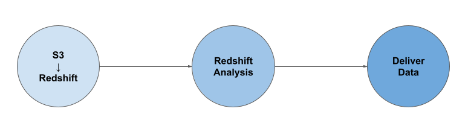
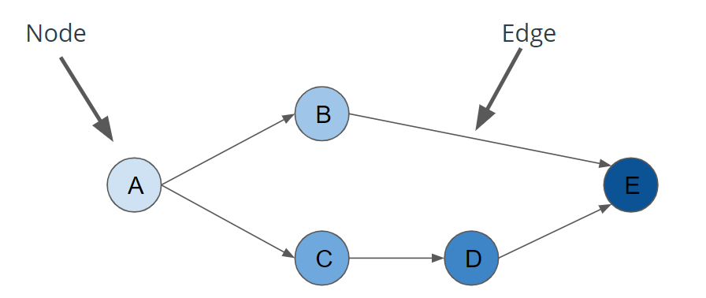
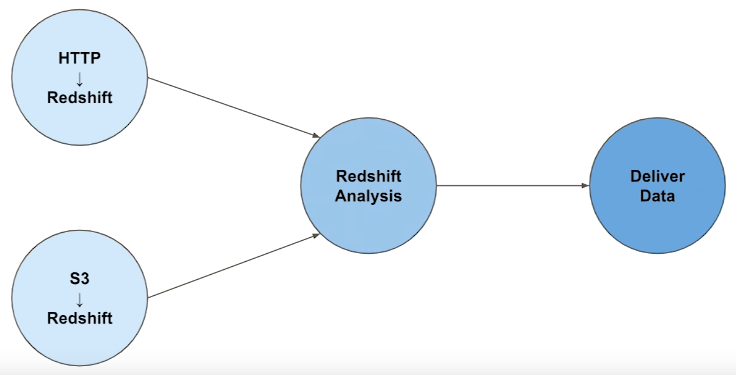
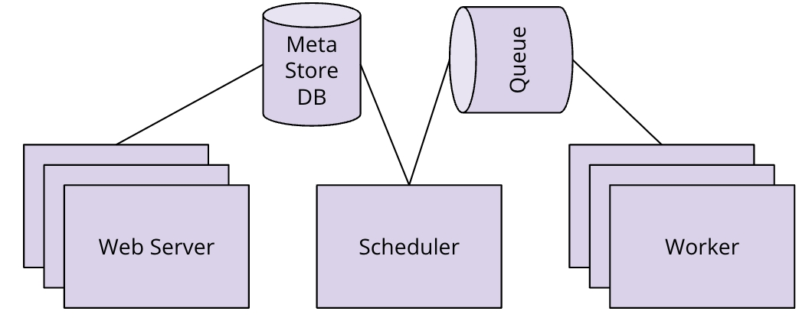
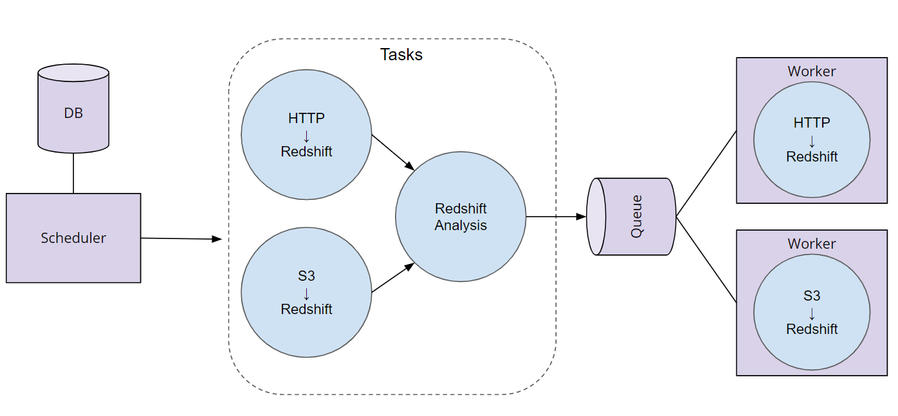

# Automate Data Pipelines

## Introdcution to Automating Data Pipelines

Focus on applying the data pipeline using an open-source tool from Airbnb called Apache Airflow.

Environment and Tools:

- Python 3
- Apache Airflow
- Amazon Web Services (AWS)
  - AWS Redshift
  - AWS S3

### Data Pipeline

- A data pipeline is a series of sequential data processing steps.
- Depending on the data requirements for each step, some steps may occur in parallel.
- Typically occur on a schedule.

<figure>
  
</figure>

<hr style="border:2px solid gray">

## Data Pipelines

### DAGs and Data Pipelines

<figure>
  
</figure>

**Bikeshare DAG Example**:

<figure>
  
</figure>

### Data Validation

- Data Validation is the process of ensuring that data is present, correct & meaningful.
- Ensuring the quality of the data through automated validation checks is a critical step in building data pipelines at any organization.
- Example: Bike sharing data, following validation steps are possible:
  - After loading from S3 to Redshift:
    - Validate the number of rows in Redshift match the number of records in S3
  - Once location business analysis is complete:
    - Validate that all locations have a daily visit average greater than 0
    - Validate that the number of locations in our output table match the number of tables in the input table

### Apache Airflow

- Platform to programmatically author, schedule and monitor workflows as DAGs of tasks.
- The airflow scheduler executes your tasks on an array of workers while following the specified dependencies.
- Simple to maintain
- Can run data analysis itself or trigger external tools during execution.
- Provides a web-based UI for users to visualize and interact with their data pipelines.
- Official Doc: [Apache Airflow](https://airflow.apache.org/)

<figure>
  
</figure>

- **Scheduler**: orchestrates the execution of jobs on a trigger or schedule.
- **Work Queue** is used by the scheduler to deliver tasks that need to be run to the Workers.
- **Worker**: processes execute the operations defined in each DAG.
- **Metastore Database**: saves credentials, connections, history, and configuration.
- **Web Interface** provides a control dashboard for users and maintainers.

<figure>
  
</figure>


1. The Airflow Scheduler starts DAGs based on time or external triggers.
2. Once a DAG is started, the Scheduler looks at the steps within the DAG and determines which steps can run by looking at their dependencies.
3. The Scheduler places runnable steps in the queue.
4. Workers pick up those tasks and run them.
5. Once the worker has finished running the step, the final status of the task is recorded and additional tasks are placed by the scheduler until all tasks are complete.
6. Once all tasks have been completed, the DAG is complete.

**Exercise**: [Airflow DAGs](exercises/airflow_dags.py)

**Operators**:

- Define the atomic steps of work that make upa DAG
- common operators:
  - PythonOperator
  - PostgresOperator
  - RedshiftToS3Operator
  - S3ToRedshiftOperator
  - BashOperator
  - SimpleHttpOperator
  - Sensor

**DAG Decorator**:

- Annotation used to mark a function as the definition of a DAG.

```python
import pendulum
import logging
from airflow.decorators import dag

@dag(description='Analyzes test Data',
    start_date=pendulum.now(),
    schedule_interval='@daily')
def divvy_dag():
```

**Operators and Tasks**:

- Operators: Define atomic steps of work that make up a DAG.
- Tasks: Instantiated operators

```python
from airflow import DAG
from airflow.operators.python_operator import PythonOperator

def hello_world():
    print(“Hello World”)

divvy_dag = DAG(...)
task = PythonOperator(
    task_id=’hello_world’,
    python_callable=hello_world,
    dag=divvy_dag)
```

Tasks can be defined using ```@task```decorators

```python
@task()
    def hello_world_task():
      logging.info("Hello World")
```

**Schedules**:

Define with cron strings or Airflow presets.

```@once```, ```@hourly```, ```@daily```, ```@weekly```, ```@monthly```, ```@yearly```, ```None```

**Start Date**: if start date is in the past, DAG will run as many times as there are schedule intervals between that start date and the current date.

**End Date**: Unless an optional end date is specified, DAGs will continue run until it get disabled or deleted.

**Exercise**: [Run the schedules](exercises/run_the_schedules.py)

<hr style="border:2px solid gray">

#### Task Dependencies

In DAGs:

- Nodes = Tasks
- Edges = Ordering and dependencies between tasks.
- ```a >> b``` means a comes before b. Similarly```a << b``` means a comes after b.
- Can also use ```set_downstream``` and ```set_upstream```
eg:

```python
hello_world_task = PythonOperator(task_id=’hello_world’, ...)
goodbye_world_task = PythonOperator(task_id=’goodbye_world’, ...)
...
# Use >> to denote that goodbye_world_task depends on hello_world_task
hello_world_task >> goodbye_world_task

# With set_downstream or set_upstream
hello_world_task.set_downstream(goodbye_world_task)
```

**Exercise**: [Task Dependencies](exercises/task_dependencies.py)

#### Airflow Hooks

- Connections can be access in code via hooks.
- Hooks provide a reusable interface to external systems and databases.
- Common hooks:
  - ```HttpHook```
  - ```PostgresHook```
  - ```MySqlHook```
  - ```SlackHook```
  - ```PrestoHook```

eg:

```python
from airflow import DAG
from airflow.hooks.postgres_hook import PostgresHook
from airflow.operators.python_operator import PythonOperator

def load():
# Create a PostgresHook option using the `demo` connection
    db_hook = PostgresHook(‘demo’)
    df = db_hook.get_pandas_df('SELECT * FROM rides')
    print(f'Successfully used PostgresHook to return {len(df)} records')

load_task = PythonOperator(task_id=’load’, python_callable=hello_world, ...)
```

#### Context Variables

**kwargs parameter to accept the runtime variables in task.

```python
from airflow.decorators import dag, task

@dag(
  schedule_interval="@daily";
)
def template_dag(**kwargs):

  @task
  def hello_date():
    print(f"Hello {kwargs['ds']}}")
```

**Exercise**: [Context Templating](exercises/context_templating.py)

## Airflow and AWS

<hr style="border:2px solid gray">

## Data Quality

<hr style="border:2px solid gray">

## Production Data Pipelines

<hr style="border:2px solid gray">

## Project: Data Pipelines
