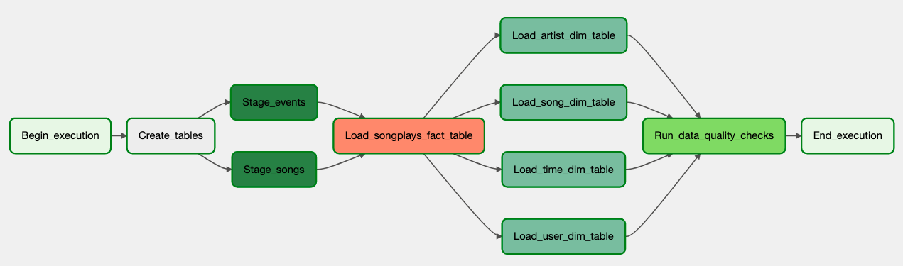

# Project: Data Pipelines with Airflow

## Introduction

A music streaming company, Sparkify, has decided that it is time to introduce more automation and monitoring to their data warehouse ETL pipelines and come to the conclusion that the best tool to achieve this is Apache Airflow.

They have decided to bring you into the project and expect you to create high grade data pipelines that are dynamic and built from reusable tasks, can be monitored, and allow easy backfills. They have also noted that the data quality plays a big part when analyses are executed on top the data warehouse and want to run tests against their datasets after the ETL steps have been executed to catch any discrepancies in the datasets.

The source data resides in S3 and needs to be processed in Sparkify's data warehouse in Amazon Redshift. The source datasets consist of JSON logs that tell about user activity in the application and JSON metadata about the songs the users listen to.

## Project Details

### Datasets

- Log data: ```s3://udacity-dend/log_data```
- Song data: ```s3://udacity-dend/song_data```

### Data pipeline with Airflow

Create custom operators to perform tasks such as staging the data, filling the data warehouse, and running checks on the data as the final step.

## Implementation

### Copy S3 Data

- Create S3 bucket

```bash
aws s3 mb s3://uc-de-airflow-aws/
```

- Copy the data from the udacity bucket to the home cloudshell directory:

```bash
aws s3 cp s3://udacity-dend/log-data/ ~/log-data/ --recursive
aws s3 cp s3://udacity-dend/song-data/ ~/song-data/ --recursive
```

- Copy the data from the home cloudshell directory to required bucket:

```bash
aws s3 cp ~/log-data/ s3://uc-de-airflow-aws/log-data/ --recursive
aws s3 cp ~/song-data/ s3://uc-de-airflow-aws/song-data/ --recursive
```

- List the data in your own bucket to be sure it copied over

```bash
aws s3 ls s3://uc-de-airflow-aws/log-data/
aws s3 ls s3://uc-de-airflow-aws/song-data/
```

### Airflow DAG

<figure>
  
</figure>

**Operators**:

- ```Begin_execution``` and ```End_executiom```: Dummy operators represents starting and end of DAG.
- ```Create_tables```: create required database tables.
- ```Stage_events``` and ```Stage_songs```:  extract data from S3 to Redshift staging tables.
- ```Load_songplays_fact_table```: load data from staging tables to fact table.
- ```Load_user_dim_table```, ```Load_song_dim_table```, ```Load_artist_dim_table``` and ```Load_time_dim_table```: load data from staging tables to dimension tables.
- ```Run_data_quality_checks```: operator to run data quality checks.

## Execution

1. Create S3 Bucket and copy data from source.
2. Add AWS connection info in Airflow via UI
3. Create Redshift serverless and connection information and store it in Airflow via UI
4. Run project DAG and monitor the execution via Airflow UI.